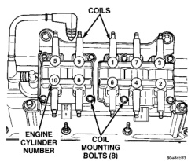

# 8D - 4 IGNITION SYSTEM BR

## DESCRIPTION AND OPERATION (Continued)

*Fig. 3 Ignition Coil Packs—8.0L V-10 Engine]*

- Number 9 and 8
- Number 1 and 6
- Number 7 and 4
- Number 3 and 2

The ignition system is controlled by the powertrain control module (PCM) on all engines. The PCM was formerly referred to as the SBEC or engine controller.

The automatic shutdown (ASD) relay, after receiving signals from the crankshaft and camshaft position sensors, will supply battery voltage to all of the ignition coil positive terminals. If these signals are not received by the PCM after approximately one second of engine cranking (start-up), the ASD relay will shut off positive voltage to all of the coils. Coil operation (firing) is then controlled by switching ground circuits (off-and-on) through the PCM. The PCM will determine cylinder identification after receiving signals from the crankshaft and camshaft position sensors.

The PCM adjusts ignition timing based on inputs it receives from:
- The engine coolant temperature sensor
- The crankshaft position sensor (engine speed)
- The manifold absolute pressure (MAP) sensor
- The throttle position sensor
- Transmission gear selection

### AUTOMATIC SHUTDOWN (ASD) RELAY—8.0L V-10 ENGINE

As one of its functions, the ASD relay will supply battery voltage to each of the 5 independent ignition coils. The ground circuit for the ASD relay is controlled by the Powertrain Control Module (PCM). The PCM regulates ASD relay operation by switching the ground circuit on-and-off.

### AUTOMATIC SHUTDOWN (ASD) RELAY—3.9L/5.2L/5.9L ENGINES

As one of its functions, the ASD relay will supply battery voltage to the ignition coil. The ground circuit for the ASD relay is controlled by the Powertrain Control Module (PCM). The PCM regulates ASD relay operation by switching the ground circuit on-and-off.

### CRANKSHAFT POSITION SENSOR—3.9L V-6 ENGINE

Engine speed and crankshaft position are provided through the crankshaft position sensor. The sensor generates pulses that are the input sent to the Powertrain Control Module (PCM). The PCM interprets the sensor input to determine the crankshaft position. The PCM then uses this position, along with other inputs, to determine injector sequence and ignition timing.

The sensor is a hall effect device combined with an internal magnet. It is also sensitive to steel within a certain distance from it.

The flywheel/drive plate has groups of notches at its outer edge. On 3.9L V-6 engines, there are three sets of double notches and three sets of single notches (Fig. 4).

The notches cause a pulse to be generated when they pass under the sensor. The pulses are the input to the PCM.

The engine will not operate if the PCM does not receive a crankshaft position sensor input.

[Figure: Fig. 4 Sensor Operation—3.9L Engine]
