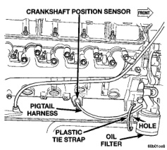
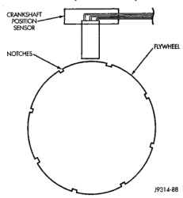
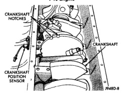

# BR IGNITION SYSTEM 8D - 5

## DESCRIPTION AND OPERATION (Continued)

### CRANKSHAFT POSITION SENSOR—5.2L/5.9L V-8 ENGINES

Engine speed and crankshaft position are provided through the crankshaft position sensor. The sensor generates pulses that are the input sent to the Powertrain Control Module (PCM). The PCM interprets the sensor input to determine the crankshaft position. The PCM then uses this position, along with other inputs, to determine injector sequence and ignition timing.

The sensor is a hall effect device combined with an internal magnet. It is also sensitive to steel within a certain distance from it.

On 5.2L and 5.9L V-8 engines, the flywheel/drive plate has 8 single notches, spaced every 45 degrees, at its outer edge (Fig. 5).

The notches cause a pulse to be generated when they pass under the sensor. The pulses are the input to the PCM. For each engine revolution, there are 8 pulses generated on V-8 engines.

The engine will not operate if the PCM does not receive a crankshaft position sensor input.

*Fig. 5 Sensor Operation—5.2L/5.9L Engine]*

### CRANKSHAFT POSITION SENSOR—8.0L V-10 ENGINE

The crankshaft position sensor is located on the right-lower side of the cylinder block, forward of the right engine mount, just above the oil pan rail (Fig. 6).

The crankshaft position sensor detects notches machined into the middle of the crankshaft (Fig. 7).

*Fig. 6 Crankshaft Position Sensor Location—8.0L V-10 Engine]*

*Fig. 7 Crankshaft Position Sensor Operation—8.0L V-10 Engine]*

There are five sets of notches. Each set contains two notches. Basic ignition timing is determined by the position of the last notch in each set of notches. Once the powertrain control module (PCM) senses the last notch, it will determine crankshaft position (which piston will next be at Top Dead Center). An input from the camshaft position sensor is also needed. It may take the module up to one complete engine revolution to determine crankshaft position during engine cranking.

The PCM uses the signal from the camshaft position sensor to determine fuel injector sequence. Once crankshaft position has been determined, the PCM begins energizing a ground circuit to each fuel injector to provide injector operation.
