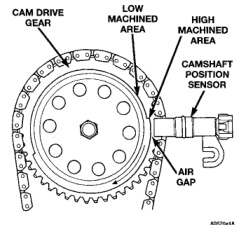
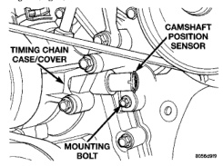

# 8D - 6 IGNITION SYSTEM BR

## DESCRIPTION AND OPERATION (Continued)

### CAMSHAFT POSITION SENSOR—3.9L/5.2L/5.9L ENGINES

The camshaft position sensor is located in the distributor on all engines.

The sensor contains a hall effect device called a sync signal generator to generate a fuel sync signal. This sync signal generator detects a rotating pulse ring (shutter) on the distributor shaft. The pulse ring rotates 180 degrees through the sync signal generator. Its signal is used in conjunction with the crankshaft position sensor to differentiate between fuel injection and spark events. It is also used to synchronize the fuel injectors with their respective cylinders.

When the leading edge of the pulse ring (shutter) enters the sync signal generator, the following occurs: The interruption of magnetic field causes the voltage to switch high resulting in a sync signal of approximately 5 volts.

When the trailing edge of the pulse ring (shutter) leaves the sync signal generator, the following occurs: The change of the magnetic field causes the sync signal voltage to switch low to 0 volts.

### CAMSHAFT POSITION SENSOR—8.0L V-10 ENGINE

The camshaft position sensor is located on the timing chain case/cover on the left-front side of the engine (Fig. 8).

*Fig. 8 Camshaft Position Sensor Location—8.0L V-10 Engine]*

The camshaft position sensor is used in conjunction with the crankshaft position sensor to differentiate between fuel injection and spark events. It is also used to synchronize the fuel injectors with their respective cylinders. The sensor generates electrical pulses. These pulses (signals) are sent to the powertrain control module (PCM). The PCM will then determine crankshaft position from both the camshaft position sensor and crankshaft position sensor.

A low and high area are machined into the camshaft drive gear (Fig. 9). The sensor is positioned in the timing gear cover so that a small air gap (Fig. 9) exists between the face of sensor and the high machined area of cam gear.

When the cam gear is rotating, the sensor will detect the machined low area. Input voltage from the sensor to the PCM will then switch from a low (approximately 0.3 volts) to a high (approximately 5 volts). When the sensor detects the high machined area, the input voltage switches back low to approximately 0.3 volts.

*Fig. 9 Sensor Operation—8.0L V-10 Engine]*

### MANIFOLD ABSOLUTE PRESSURE (MAP) SENSOR

For an operational description, diagnosis and removal/installation procedures, refer to Group 14, Fuel System.

### ENGINE COOLANT TEMPERATURE SENSOR

For an operational description, diagnosis and removal/installation procedures, refer to Group 14, Fuel System.

### THROTTLE POSITION SENSOR

For an operational description, diagnosis and removal/installation procedures, refer to Group 14, Fuel System.

### INTAKE MANIFOLD AIR TEMPERATURE SENSOR

For an operational description, diagnosis and removal/installation procedures, refer to Group 14, Fuel System.
