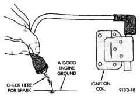
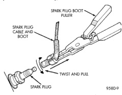

# BR IGNITION SYSTEM 8D - 7

## DESCRIPTION AND OPERATION (Continued)

### IGNITION SWITCH AND KEY LOCK CYLINDER

The ignition switch is located on the steering column. The Key-In-Switch is located in the ignition switch module. For electrical diagnosis of the Key-In-Switch, refer to Group 8U, Chime/Buzzer Warning Systems. For removal/installation of either the key lock cylinder or ignition switch, refer to Ignition Switch and Key Cylinder Removal/Installation in this group.

On vehicles equipped with an automatic transmission, a cable connects an interlock device within the steering column assembly to the transmission floor shift lever. This interlock device is used to lock the transmission shifter in the PARK position when the key is in the LOCKED or ACCESSORY position. The interlock device is not serviceable. If repair is necessary, the steering column assembly must be replaced. Refer to Group 19, Steering for procedures. The shifter interlock cable can be adjusted or replaced. Refer to Group 21, Transmissions for procedures.

## DIAGNOSIS AND TESTING

### AUTOMATIC SHUTDOWN (ASD) RELAY TEST

To perform a complete test of this relay and its circuitry, refer to the DRB scan tool. Also refer to the appropriate Powertrain Diagnostics Procedures manual. To test the relay only, refer to Relays—Operation/Testing in the Group 14, Fuel Systems section.

### TESTING FOR SPARK AT COIL—3.9L/5.2L/5.9L ENGINES

**CAUTION: When disconnecting a high voltage cable from a spark plug or from the distributor cap, twist the rubber boot slightly (1/2 turn) to break it loose (Fig. 10). Grasp the boot (not the cable) and pull it off with a steady, even force.**

*Fig. 10 Cable Removal]*

(1) Disconnect the ignition coil secondary cable from center tower of the distributor cap. Hold the cable terminal approximately 12 mm (1/2 in.) from a good engine ground (Fig. 11).

*Fig. 11 Checking for Spark—Typical]*

**WARNING: BE VERY CAREFUL WHEN THE ENGINE IS CRANKING. DO NOT PUT YOUR HANDS NEAR THE PULLEYS, BELTS OR THE FAN. DO NOT WEAR LOOSE FITTING CLOTHING.**

(2) Rotate (crank) the engine with the starter motor and observe the cable terminal for a steady arc. If steady arcing does not occur, inspect the secondary coil cable. Refer to Spark Plug Cables in this group. Also inspect the distributor cap and rotor for cracks or burn marks. Repair as necessary. If steady arcing occurs, connect ignition coil cable to the distributor cap.

(3) Remove a cable from one spark plug.

(4) Using insulated pliers, hold the cable terminal approximately 12 mm (1/2 in.) from the engine cylinder head or block while rotating the engine with the starter motor. Observe the spark plug cable terminal for an arc. If steady arcing occurs, it can be expected that the ignition secondary system is operating correctly. (**If the ignition coil cable is removed for this test, instead of a spark plug cable, the spark intensity will be much higher.**) If steady arcing occurs at the spark plug cables, but the engine will not start, connect the DRB scan tool. Refer to the appropriate Powertrain Diagnostic Procedures service manual.

### IGNITION COIL TEST—3.9L/5.2L/5.9L ENGINES

To perform a complete test of the ignition coil and its circuitry, refer to the DRB scan tool. Also refer to the appropriate Powertrain Diagnostics Procedures manual. To test the coil only, refer to the following:

The ignition coil (Fig. 12) is designed to operate without an external ballast resistor.
