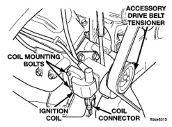
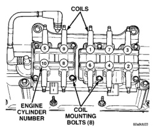

# 8D - 8 IGNITION SYSTEM BR

## DIAGNOSIS AND TESTING (Continued)

*Fig. 12 Ignition Coil (5.2L Shown)]*

Inspect the ignition coil for arcing. Test the coil according to coil tester manufacturer's instructions. Test the coil primary and secondary resistance. Replace any coil that does not meet specifications. Refer to the IGNITION COIL RESISTANCE chart.

If the ignition coil is being replaced, the secondary spark plug cable must also be checked. Replace cable if it has been burned or damaged.

Arcing at the tower will carbonize the cable boot, which if it is connected to a new ignition coil, will cause the coil to fail.

If the secondary coil cable shows any signs of damage, it should be replaced with a new cable and new terminal. Carbon tracking on the old cable can cause arcing and the failure of a new ignition coil.

### IGNITION COIL RESISTANCE—V-6/V-8

| COIL MANUFACTURER | PRIMARY RESISTANCE 21-27°C (70-80°F) | SECONDARY RESISTANCE 21-27°C (70-80°F) |
|-------------------|--------------------------------------|----------------------------------------|
| Diamond | 0.97 - 1.18 Ohms | 11,300 - 15,300 Ohms |
| Toyodenso | 0.95 - 1.20 Ohms | 11,300 - 13,300 Ohms |

### IGNITION COIL PACK TESTS—8.0L V-10 ENGINE

To perform a complete test of the ignition coil packs and their circuitry, refer to the DRB scan tool. Also refer to the appropriate Powertrain Diagnostics Procedures manual. To test the coil packs only, refer to the following procedure:

Two separate coil packs containing a total of five independent coils are attached to a common mounting bracket located above the right engine valve cover (Fig. 13). The coil packs are not oil filled. The front coil pack contains three independent epoxy filled coils that will fire six cylinders. The rear coil pack contains two independent epoxy filled coils that will fire four cylinders.

*Fig. 13 Ignition Coil Packs—8.0L V-10 Engine]*

To test the secondary resistance of each individual paired coil, attach an ohmmeter across the coil towers (Fig. 14) or (Fig. 15). This must be done between corresponding cylinders number 3/2, 7/4, 1/6, 9/8 or 5/10 (Fig. 13). Refer to the IGNITION COIL RESISTANCE—8.0L V-10 ENGINE chart for specifications.

To test the primary resistance of the front coil pack, attach an ohmmeter between the B+ coil terminal and either the right (cylinders 3/2), center (cylinders 7/4) or left coil (cylinders 1/6) terminals (Fig. 16). Refer to the IGNITION COIL RESISTANCE—8.0L V-10 ENGINE chart for specifications.

To test the primary resistance of the rear coil pack, attach an ohmmeter between the B+ coil terminal and either the right (cylinders 9/8) or left (cylinders 5/10) coil terminals (Fig. 17). Refer to the IGNITION COIL RESISTANCE—8.0L V-10 ENGINE chart for specifications.

### FAILURE TO START TEST—3.9L/5.2L/5.9L ENGINES

To prevent unnecessary diagnostic time and wrong test results, the Testing For Spark At Coil test should be performed prior to this test.

**WARNING: SET PARKING BRAKE OR BLOCK THE DRIVE WHEELS BEFORE PROCEEDING WITH THIS TEST.**
