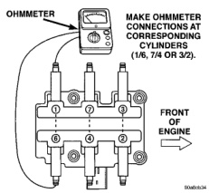
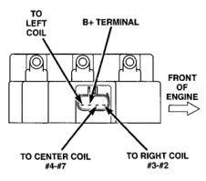
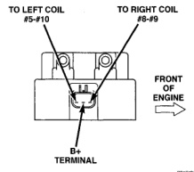
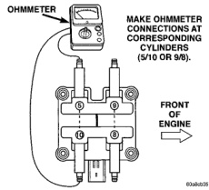

# BR IGNITION SYSTEM 8D - 9

## DIAGNOSIS AND TESTING (Continued)

*Fig. 14 Checking Coil Secondary Resistance—Front Coils—8.0L V-10 Engine]*

*Fig. 15 Checking Coil Secondary Resistance—Rear Coils—8.0L V-10 Engine]*

*Fig. 16 Checking Coil Primary Resistance—Front Coils—8.0L V-10 Engine]*

*Fig. 12 Checking Coil Primary Resistance—Rear Coils—8.0L V-10 Engine]*

### IGNITION COIL RESISTANCE—8.0L V-10 ENGINE

| Specification | Value | Notes |
|---------------|-------|-------|
| Primary Resistance | 0.53 to 0.65 Ohms | Test across the primary connector. Refer to text for test procedures. |
| Secondary Resistance | 10.9 to 14.7K Ohms | Test across the individual coil towers. Refer to text for test procedures. |

(1) Unplug the ignition coil harness connector at the coil (Fig. 12).

(2) Connect a set of small jumper wires (18 gauge or smaller) between the disconnected harness terminals and the ignition coil terminals. To determine polarity at connector and coil, refer to the Wiring Diagrams section.

(3) Attach one lead of a voltmeter to the positive (12 volt) jumper wire. Attach the negative side of voltmeter to a good ground. Determine that sufficient battery voltage (12.4 volts) is present for the starting and ignition systems.
