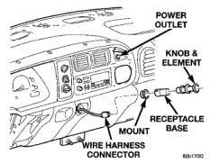
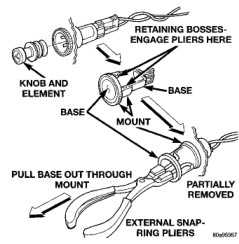

# DIAGNOSIS AND TESTING (Continued)

### WATER-IN-FUEL LAMP (Continued)

grams, refer to 8W-40 - Instrument Cluster in Group 8W - Wiring Diagrams.

**WARNING: ON VEHICLES EQUIPPED WITH AIRBAGS, REFER TO GROUP 8M - PASSIVE RESTRAINT SYSTEMS BEFORE ATTEMPTING ANY STEERING WHEEL, STEERING COLUMN, OR INSTRUMENT PANEL COMPONENT DIAGNOSIS OR SERVICE. FAILURE TO TAKE THE PROPER PRECAUTIONS COULD RESULT IN ACCIDENTAL AIRBAG DEPLOYMENT AND POSSIBLE PERSONAL INJURY.**

If the water-in-fuel lamp fails to light during the bulb test (about two seconds after the ignition switch is turned to the On position), diagnosis of the Powertrain Control Module (PCM) and the Chrysler Collision Detection (CCD) data bus should be performed with a DRB scan tool as described in the proper Diagnostic Procedures manual. For further diagnosis of the water-in-fuel lamp and the instrument cluster circuitry, see Instrument Cluster in the Diagnosis and Testing section of this group.

# REMOVAL AND INSTALLATION

### CIGAR LIGHTER AND POWER OUTLET

**WARNING: ON VEHICLES EQUIPPED WITH AIRBAGS, REFER TO GROUP 8M - PASSIVE RESTRAINT SYSTEMS BEFORE ATTEMPTING ANY STEERING WHEEL, STEERING COLUMN, OR INSTRUMENT PANEL COMPONENT DIAGNOSIS OR SERVICE. FAILURE TO TAKE THE PROPER PRECAUTIONS COULD RESULT IN ACCIDENTAL AIRBAG DEPLOYMENT AND POSSIBLE PERSONAL INJURY.**

- (1) Disconnect and isolate the battery negative cable.

- (2) Pull the cigar lighter knob and element out of the cigar lighter receptacle base, or open the power outlet door in the upper inboard corner of the instrument cluster bezel (Fig. 1).

- (3) Look inside the cigar lighter or power outlet receptacle base and note the position of the rectangular retaining bosses of the mount that secures the receptacle base to the instrument panel or the instrument cluster bezel (Fig. 2).

- (4) Insert a pair of external snap ring pliers into the cigar lighter or power outlet receptacle base and engage the tips of the pliers with the retaining bosses of the mount.

- (5) Squeeze the pliers to disengage the mount retaining bosses from the receptacle base and, using

*Fig. 1 Cigar Lighter and Power Outlet*

*Fig. 2 Cigar Lighter and Power Outlet Remove/Install*

a gentle rocking motion, pull the pliers and the receptacle base out of the mount.

- (6) Pull the receptacle base away from the instrument panel or the instrument cluster bezel far enough to access and unplug the wire harness connector.

- (7) Remove the cigar lighter or power outlet mount from the instrument panel or the instrument cluster bezel.

- (8) Reverse the removal procedures to install.

---
*8E_Instrument_Panel_Systems - Page 25*
