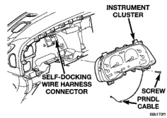
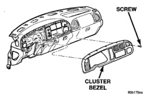

# REMOVAL AND INSTALLATION (Continued)

### CLUSTER BEZEL

**WARNING: ON VEHICLES EQUIPPED WITH AIRBAGS, REFER TO GROUP 8M - PASSIVE RESTRAINT SYSTEMS BEFORE ATTEMPTING ANY STEERING WHEEL, STEERING COLUMN, OR INSTRUMENT PANEL COMPONENT DIAGNOSIS OR SERVICE. FAILURE TO TAKE THE PROPER PRECAUTIONS COULD RESULT IN ACCIDENTAL AIRBAG DEPLOYMENT AND POSSIBLE PERSONAL INJURY.**

- (1) Disconnect and isolate the battery negative cable.

- (2) If the vehicle is equipped with an automatic transmission, turn the ignition switch to the Unlock position, set the parking brake, and place the automatic transmission gear selector lever in the Low position.

- (3) If the vehicle is so equipped, set the tilt steering column in its lowest position.

- (4) Open the door for the power outlet and remove the one screw that secures the cluster bezel to the instrument panel.

- (5) Using a trim stick or another suitable wide flat-bladed tool, gently pry around the perimeter of the cluster bezel to disengage the snap clip retainers that secure the cluster bezel to the instrument panel (Fig. 3).

*Fig. 3 Cluster Bezel Remove/Install*

- (6) Pull the cluster bezel away from the instrument panel far enough to access and unplug the wire harness connector from the back of the power outlet receptacle base.

- (7) Remove the cluster bezel from the instrument panel.

- (8) Reverse the removal procedures to install. Tighten the mounting screw to 2.2 N-m (20 in. lbs.).

### INSTRUMENT CLUSTER

**WARNING: ON VEHICLES EQUIPPED WITH AIRBAGS, REFER TO GROUP 8M - PASSIVE RESTRAINT SYSTEMS BEFORE ATTEMPTING ANY STEERING WHEEL, STEERING COLUMN, OR INSTRUMENT PANEL COMPONENT DIAGNOSIS OR SERVICE. FAILURE TO TAKE THE PROPER PRECAUTIONS COULD RESULT IN ACCIDENTAL AIRBAG DEPLOYMENT AND POSSIBLE PERSONAL INJURY.**

- (1) Remove the cluster bezel from the instrument panel. See Cluster Bezel in the Removal and Installation section of this group for the procedures.

- (2) Remove the four screws that secure the instrument cluster to the instrument panel (Fig. 4).

*Fig. 4 Instrument Cluster Remove/Install*

- (3) Pull the instrument cluster rearward to disengage the two self-docking wire harness connectors.

**NOTE:** The instrument cluster has two self-docking wire harness connectors that will be automatically aligned with, and connected to the instrument panel wire harness when the cluster is installed in the instrument panel.

- (4) If the vehicle is equipped with an automatic transmission, pull the instrument cluster rearward far enough to access and remove the gear selector indicator from the back of the cluster housing. See Gear Selector Indicator in the Removal and Installation section of this group for the procedures.

- (5) Remove the instrument cluster from the instrument panel.

- (6) Reverse the removal procedures to install. Tighten the mounting screws to 2.2 N-m (20 in. lbs.).

---
*8E_Instrument_Panel_Systems - Page 26*
