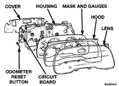
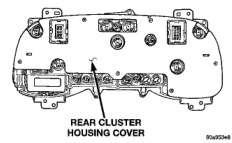

# REMOVAL AND INSTALLATION (Continued)

### CLUSTER LENS AND HOOD

**WARNING: ON VEHICLES EQUIPPED WITH AIRBAGS, REFER TO GROUP 8M - PASSIVE RESTRAINT SYSTEMS BEFORE ATTEMPTING ANY STEERING WHEEL, STEERING COLUMN, OR INSTRUMENT PANEL COMPONENT DIAGNOSIS OR SERVICE. FAILURE TO TAKE THE PROPER PRECAUTIONS COULD RESULT IN ACCIDENTAL AIRBAG DEPLOYMENT AND POSSIBLE PERSONAL INJURY.**

- (1) Disconnect and isolate the battery negative cable.

- (2) Remove the instrument cluster from the instrument panel. See Instrument Cluster in the Removal and Installation section of this group for the procedures.

- (3) Remove the seven screws that secure the cluster lens and hood to the cluster housing (Fig. 5).

*Fig. 5 Instrument Cluster Components*

- (4) Remove the cluster lens and the cluster hood from the cluster housing.

**CAUTION:** Do not touch the face of the gauge mask or the back of the cluster lens with your finger. It will leave a permanent fingerprint.

- (5) Reverse the removal procedures to install. Tighten the mounting screws to 2.2 N-m (20 in. lbs.).

### CLUSTER HOUSING REAR COVER

**WARNING: ON VEHICLES EQUIPPED WITH AIRBAGS, REFER TO GROUP 8M - PASSIVE RESTRAINT SYSTEMS BEFORE ATTEMPTING ANY STEERING WHEEL, STEERING COLUMN, OR INSTRUMENT PANEL COMPONENT DIAGNOSIS OR SERVICE. FAILURE TO TAKE THE PROPER PRECAUTIONS COULD RESULT IN ACCIDENTAL AIRBAG DEPLOYMENT AND POSSIBLE PERSONAL INJURY.**

- (1) Disconnect and isolate the battery negative cable.

- (2) Remove the instrument cluster from the instrument panel. See Instrument Cluster in the Removal and Installation section of this group for the procedures.

- (3) Remove the six screws that secure the rear cover to the cluster housing (Fig. 6).

*Fig. 6 Cluster Housing Rear Cover Remove/Install*

- (4) Remove the rear cover from the cluster housing.

- (5) Reverse the removal procedures to install. Tighten the mounting screws to 2.2 N-m (20 in. lbs.).

### GEAR SELECTOR INDICATOR

**WARNING: ON VEHICLES EQUIPPED WITH AIRBAGS, REFER TO GROUP 8M - PASSIVE RESTRAINT SYSTEMS BEFORE ATTEMPTING ANY STEERING WHEEL, STEERING COLUMN, OR INSTRUMENT PANEL COMPONENT DIAGNOSIS OR SERVICE. FAILURE TO TAKE THE PROPER PRECAUTIONS COULD RESULT IN ACCIDENTAL AIRBAG DEPLOYMENT AND POSSIBLE PERSONAL INJURY.**

- (1) Disconnect and isolate the battery negative cable.

- (2) Remove the instrument cluster from the instrument panel. See Instrument Cluster in the Removal and Installation section of this group for the procedures.

- (3) Remove the two screws that secure the gear selector indicator mechanism to the rear of the instrument cluster housing (Fig. 7).

- (4) Remove the gear selector indicator mechanism from the cluster housing.

- (5) Remove the steering column opening cover and knee blocker from the instrument panel. See Steering

---
*8E_Instrument_Panel_Systems - Page 27*
