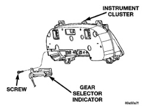
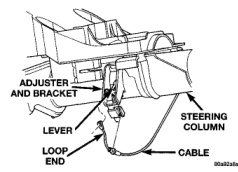
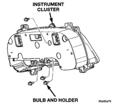

# REMOVAL AND INSTALLATION (Continued)

### GEAR SELECTOR INDICATOR (Continued)

*Fig. 7 Gear Selector Indicator Remove/Install*

Column Opening Cover and Knee Blocker in the Removal and Installation section of this group for the procedures.

- (6) Disengage the loop end of the gear selector indicator cable from the lever on the left side of the steering column (Fig. 8).

*Fig. 8 Gear Selector Indicator Cable Remove/Install*

- (7) Squeeze the sides of the plastic adjuster bracket to disengage the tabs that secure it to the sides of the steering column window.

- (8) Reverse the removal procedures to install. Tighten the gear selector indicator mounting screws to 2.2 N-m (20 in. lbs.). Refer to Group 19 - Steering for the gear selector indicator cable adjustment procedure.

### CLUSTER BULB

**WARNING: ON VEHICLES EQUIPPED WITH AIRBAGS, REFER TO GROUP 8M - PASSIVE RESTRAINT SYSTEMS BEFORE ATTEMPTING ANY STEERING WHEEL, STEERING COLUMN, OR INSTRUMENT PANEL COMPONENT DIAGNOSIS OR SERVICE. FAILURE TO TAKE THE PROPER PRECAUTIONS COULD RESULT IN ACCIDENTAL AIRBAG DEPLOYMENT AND POSSIBLE PERSONAL INJURY.**

- (1) Remove the instrument cluster from the instrument panel. See Instrument Cluster in the Removal and Installation section of this group for the procedures.

- (2) Remove the bulb and bulb holder from the circuit board on the rear of the instrument cluster housing by turning the holder counterclockwise (Fig. 9).

*Fig. 9 Cluster Bulb Remove/Install*

**CAUTION:** Always use the correct bulb size and type for replacement. An incorrect bulb size or type may overheat and cause damage to the instrument cluster circuit board and/or the gauges.

- (3) Reverse the removal procedures to install.

### HEADLAMP SWITCH

**WARNING: ON VEHICLES EQUIPPED WITH AIRBAGS, REFER TO GROUP 8M - PASSIVE RESTRAINT SYSTEMS BEFORE ATTEMPTING ANY STEERING WHEEL, STEERING COLUMN, OR INSTRUMENT PANEL COMPONENT DIAGNOSIS OR SERVICE. FAILURE TO TAKE THE PROPER PRECAUTIONS COULD RESULT IN ACCIDENTAL AIRBAG DEPLOYMENT AND POSSIBLE PERSONAL INJURY.**

---
*8E_Instrument_Panel_Systems - Page 28*
