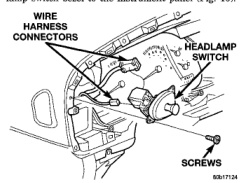
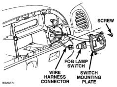

# REMOVAL AND INSTALLATION (Continued)

### HEADLAMP SWITCH (Continued)

**WARNING: IF THE HEADLAMP SWITCH WAS ON, WAIT FIVE MINUTES TO ALLOW THE CERAMIC DIMMER RESISTOR TO COOL. IF THE CERAMIC DIMMER RESISTOR IS NOT ALLOWED TO COOL, IT CAN BURN YOUR FINGERS.**

- (1) Disconnect and isolate the battery negative cable.

- (2) Remove the cluster bezel from the instrument panel. See Cluster Bezel in the Removal and Installation section of this group for the procedures.

- (3) Remove the three screws that secure the headlamp switch bezel to the instrument panel (Fig. 10).

*Fig. 10 Headlamp Switch and Bezel Remove/Install*

- (4) Pull the headlamp switch and bezel out from the instrument panel far enough to access the wire harness connectors.

- (5) Unplug the two wire harness connectors from the headlamp switch.

- (6) Pull the headlamp switch control knob out to the On position stop.

- (7) Depress the headlamp switch knob and shaft release button on the top of the switch.

- (8) While holding the release button depressed, pull the knob and shaft out of the headlamp switch.

- (9) Remove the two push nut retainers that secure the headlamp switch bezel to the switch mounting bracket.

- (10) Remove the headlamp switch bezel from the switch mounting bracket.

- (11) Remove the spanner nut that secures the headlamp switch mounting bracket to the switch.

- (12) Remove the headlamp switch mounting bracket from the switch.

- (13) Reverse the removal procedures to install. Tighten the headlamp switch and bezel mounting screws to 2.2 N-m (20 in. lbs.).

### FOG LAMP SWITCH

**WARNING: ON VEHICLES EQUIPPED WITH AIRBAGS, REFER TO GROUP 8M - PASSIVE RESTRAINT SYSTEMS BEFORE ATTEMPTING ANY STEERING WHEEL, STEERING COLUMN, OR INSTRUMENT PANEL COMPONENT DIAGNOSIS OR SERVICE. FAILURE TO TAKE THE PROPER PRECAUTIONS COULD RESULT IN ACCIDENTAL AIRBAG DEPLOYMENT AND POSSIBLE PERSONAL INJURY.**

- (1) Disconnect and isolate the battery negative cable.

- (2) Remove the cluster bezel from the instrument panel. See Cluster Bezel in the Removal and Installation section of this group for the procedures.

- (3) Remove the three screws that secure the switch mounting plate to the instrument panel (Fig. 11).

*Fig. 11 Fog Lamp Switch Remove/Install*

- (4) Pull the switch mounting plate away from the instrument panel far enough to access and unplug the wire harness connector from the back of the fog lamp switch.

- (5) Squeeze the tabs on the back of the fog lamp switch that secure it in the receptacle on the back of the switch mounting plate.

- (6) Pull the fog lamp switch out of the receptacle on the back of the switch mounting plate.

- (7) Reverse the removal procedures to install. Be certain that the fog lamp switch latches are fully engaged in the switch mounting plate receptacle. Tighten the mounting screws to 2.2 N-m (20 in. lbs.).

---
*8E_Instrument_Panel_Systems - Page 29*
