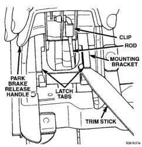
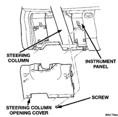

# REMOVAL AND INSTALLATION (Continued)

### PARK BRAKE RELEASE HANDLE

**WARNING: ON VEHICLES EQUIPPED WITH AIRBAGS, REFER TO GROUP 8M - PASSIVE RESTRAINT SYSTEMS BEFORE ATTEMPTING ANY STEERING WHEEL, STEERING COLUMN, OR INSTRUMENT PANEL COMPONENT DIAGNOSIS OR SERVICE. FAILURE TO TAKE THE PROPER PRECAUTIONS COULD RESULT IN ACCIDENTAL AIRBAG DEPLOYMENT AND POSSIBLE PERSONAL INJURY.**

- (1) Disconnect and isolate the battery negative cable.

- (2) Reach under the driver side outboard end of the instrument panel to access and unsnap the plastic retainer clip from the park brake release linkage rod at the park brake mechanism on the left cowl side inner panel.

- (3) Disengage the park brake release linkage rod end from the park brake mechanism.

- (4) Lift the park brake release handle to access and unsnap the plastic retainer clip from the park brake release linkage rod at the park brake release handle on the instrument panel.

- (5) Lower the park brake release handle and reach under the instrument panel to disengage the park brake release linkage rod end from the park brake release handle.

- (6) Lift the park brake release handle to access the handle mounting bracket. Using a trim stick or another suitable wide flat-bladed tool, gently pry each of the park brake release handle mounting bracket latch tabs away from the retaining notches in the instrument panel receptacle (Fig. 12).

- (7) With both of the park brake release handle mounting bracket latches released, slide the handle and bracket assembly down and out of the instrument panel receptacle.

- (8) Reverse the removal procedures to install.

### STEERING COLUMN OPENING COVER AND KNEE BLOCKER

**WARNING: ON VEHICLES EQUIPPED WITH AIRBAGS, REFER TO GROUP 8M - PASSIVE RESTRAINT SYSTEMS BEFORE ATTEMPTING ANY STEERING WHEEL, STEERING COLUMN, OR INSTRUMENT PANEL COMPONENT DIAGNOSIS OR SERVICE. FAILURE TO TAKE THE PROPER PRECAUTIONS COULD RESULT IN ACCIDENTAL AIRBAG DEPLOYMENT AND POSSIBLE PERSONAL INJURY.**

- (1) Disconnect and isolate the battery negative cable.

*Fig. 12 Park Brake Release Handle Remove/Install*

- (2) Remove the three screws that secure the bottom of the steering column opening cover and knee blocker to the lower instrument panel reinforcement (Fig. 13).

*Fig. 13 Steering Column Opening Cover and Knee Blocker Remove/Install*

- (3) Using a trim stick or another suitable wide flat-bladed tool, gently pry the upper edges of the steering column opening cover and knee blocker to release the snap clip retainers that secure it to the

---
*8E_Instrument_Panel_Systems - Page 30*
