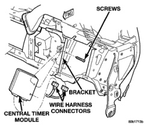
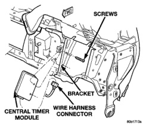

# REMOVAL AND INSTALLATION (Continued)

instrument panel on each side of the steering column.

(4) Remove the steering column opening cover and knee blocker from the instrument panel.

(5) Reverse the removal procedures to install. Tighten the mounting screws to 2.2 N-m (20 in. lbs.).

### CENTRAL TIMER MODULE

Before replacing a high-line Central Timer Module (CTM), use a DRB scan tool to determine the current settings for the CTM programmable features. These settings should be duplicated in the replacement CTM using the DRB scan tool, before returning the vehicle to service.

**WARNING: ON VEHICLES EQUIPPED WITH AIRBAGS, REFER TO GROUP 8M - PASSIVE RESTRAINT SYSTEMS BEFORE ATTEMPTING ANY STEERING WHEEL, STEERING COLUMN, OR INSTRUMENT PANEL COMPONENT DIAGNOSIS OR SERVICE. FAILURE TO TAKE THE PROPER PRECAUTIONS COULD RESULT IN ACCIDENTAL AIRBAG DEPLOYMENT AND POSSIBLE PERSONAL INJURY.**

(1) Disconnect and isolate the battery negative cable.

(2) Remove the steering column opening cover and knee blocker from the instrument panel. See Steering Column Opening Cover and Knee Blocker in the Removal and Installation section of this group for the procedures.

(3) Remove the two screws that secure the Central Timer Module (CTM) to the bracket on the inboard side of the instrument panel steering column opening (Fig. 14) or (Fig. 15).

*Fig. 14 Central Timer Module (Base) Remove/Install*

*Fig. 15 Central Timer Module (High-Line) Remove/Install*

(4) Pull the CTM into the instrument panel steering column opening far enough to access and unplug the wire harness connector(s).

(5) Remove the CTM from the instrument panel.

(6) Reverse the removal procedures to install. Tighten the mounting screws to 1.6 N-m (15 in. lbs.).

**NOTE:** If a new high-line Central Timer Module is installed, the programmable features must be enabled and/or disabled to the customer's preferred settings. Use a DRB scan tool and the proper Diagnostic Procedures manual to perform these operations.

### ASH RECEIVER

**WARNING: ON VEHICLES EQUIPPED WITH AIRBAGS, REFER TO GROUP 8M - PASSIVE RESTRAINT SYSTEMS BEFORE ATTEMPTING ANY STEERING WHEEL, STEERING COLUMN, OR INSTRUMENT PANEL COMPONENT DIAGNOSIS OR SERVICE. FAILURE TO TAKE THE PROPER PRECAUTIONS COULD RESULT IN ACCIDENTAL AIRBAG DEPLOYMENT AND POSSIBLE PERSONAL INJURY.**

(1) Disconnect and isolate the battery negative cable.

(2) Open the ash receiver. From the open position, close the ash receiver slightly and pull it straight out from the pivot pins in the lower instrument panel.

(3) Remove the three screws that secure the flame shield to the lower instrument panel (Fig. 16).

(4) Pull the flame shield away from the lower instrument panel far enough to disengage the two

---
*8E_Instrument_Panel_Systems - Page 31*
