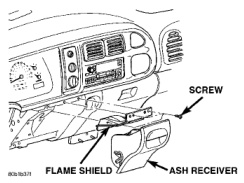
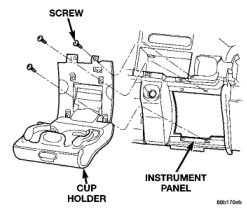
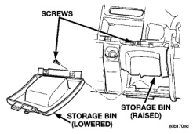

# REMOVAL AND INSTALLATION (Continued)

*Fig. 16 Ash Receiver Remove/Install*

retaining tabs on the top, then lower the shield far enough to access the ash receiver lamp and hood.

(5) Disengage the ash receiver lamp and hood retainer clip from the mounting hole in the flame shield.

(6) Remove the flame shield from the lower instrument panel.

(7) Reverse the removal procedures to install. Tighten the mounting screws to 2.2 N-m (20 in. lbs.).

### CUP HOLDER OR STORAGE BIN

Vehicles equipped with an automatic transmission have a lighted fold-down cup holder installed on the instrument panel just inboard of the glove box. Vehicles equipped with a manual transmission have a lighted storage bin installed on the instrument panel in place of the fold-down cup holder.

**WARNING: ON VEHICLES EQUIPPED WITH AIRBAGS, REFER TO GROUP 8M - PASSIVE RESTRAINT SYSTEMS BEFORE ATTEMPTING ANY STEERING WHEEL, STEERING COLUMN, OR INSTRUMENT PANEL COMPONENT DIAGNOSIS OR SERVICE. FAILURE TO TAKE THE PROPER PRECAUTIONS COULD RESULT IN ACCIDENTAL AIRBAG DEPLOYMENT AND POSSIBLE PERSONAL INJURY.**

### CUP HOLDER

(1) Disconnect and isolate the battery negative cable.

(2) Remove the cluster bezel from the instrument panel. See Cluster Bezel in the Removal and Installation section of this group for the procedures.

(3) Unlatch and fold the cup holder down from the instrument panel to its open position.

(4) Remove the six screws that secure the cup holder to the instrument panel (Fig. 17).

*Fig. 17 Cup Holder Remove/Install - Automatic Transmission Only*

(5) Pull the cup holder away from the instrument panel far enough to access and disengage the lamp and hood retainer clip from the back of the unit.

(6) Remove the cup holder unit from the instrument panel.

(7) Reverse the removal procedures to install. Tighten the mounting screws to 2.2 N-m (20 in. lbs.).

### STORAGE BIN

(1) Disconnect and isolate the battery negative cable.

(2) Remove the cluster bezel from the instrument panel. See Cluster Bezel in the Removal and Installation section of this group for the procedures.

(3) Remove the two screws that secure the top of the storage bin to the instrument panel (Fig. 18).

*Fig. 18 Storage Bin Remove/Install - Manual Transmission Only*

---
*8E_Instrument_Panel_Systems - Page 32*
