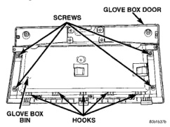
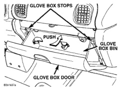

# REMOVAL AND INSTALLATION (Continued)

(4) Lower the top of the storage bin far enough to access and disengage the lamp and hood retainer clip from the back of the unit.

(5) Lower the top of the storage bin far enough to access and remove the two screws that secure the bottom of the storage bin to the instrument panel.

(6) Remove the storage bin unit from the instrument panel.

(7) Reverse the removal procedures to install. Tighten the mounting screws to 2.2 N-m (20 in. lbs.).

### GLOVE BOX

**WARNING: ON VEHICLES EQUIPPED WITH AIRBAGS, REFER TO GROUP 8M - PASSIVE RESTRAINT SYSTEMS BEFORE ATTEMPTING ANY STEERING WHEEL, STEERING COLUMN, OR INSTRUMENT PANEL COMPONENT DIAGNOSIS OR SERVICE. FAILURE TO TAKE THE PROPER PRECAUTIONS COULD RESULT IN ACCIDENTAL AIRBAG DEPLOYMENT AND POSSIBLE PERSONAL INJURY.**

(1) Disconnect and isolate the battery negative cable.

(2) Open the glove box.

(3) While securing the glove box door with one hand, push the center of the glove box bin towards the front of the vehicle (Fig. 19). Flex the glove box bin far enough so that the glove box stops on each side of the bin will clear the sides of the instrument panel glove box opening.

*Fig. 19 Glove Box Remove/Install*

(4) Roll the glove box downward until the stop bumpers are beyond the sides of the instrument panel glove box opening, then release the bin.

(5) Lift the bottom of the glove box upward to disengage the three glove box hinge hooks from the three hinge pins on the instrument panel.

(6) Reverse the removal procedures to install.

### GLOVE BOX BIN

The only serviced component of the glove box is the glove box bin. If any other component of the glove box is faulty or damaged, the entire glove box assembly must be replaced.

**WARNING: ON VEHICLES EQUIPPED WITH AIRBAGS, REFER TO GROUP 8M - PASSIVE RESTRAINT SYSTEMS BEFORE ATTEMPTING ANY STEERING WHEEL, STEERING COLUMN, OR INSTRUMENT PANEL COMPONENT DIAGNOSIS OR SERVICE. FAILURE TO TAKE THE PROPER PRECAUTIONS COULD RESULT IN ACCIDENTAL AIRBAG DEPLOYMENT AND POSSIBLE PERSONAL INJURY.**

(1) Disconnect and isolate the battery negative cable.

(2) Remove the glove box from the instrument panel. See Glove Box in the Removal and Installation section of this group for the procedures.

(3) Remove the two screws that secure each outboard flange of the glove box bin to the glove box door (Fig. 20).

*Fig. 20 Glove Box Bin Remove/Install*

(4) Pull the top of the bin away from the top of the glove box door.

(5) Disengage the five hook formations on the bottom of the glove box bin from the slots near the bottom of the inner glove box door.

(6) Reverse the removal procedures to install. Tighten the mounting screws to 2.2 N-m (20 in. lbs.).

---
*8E_Instrument_Panel_Systems - Page 33*
