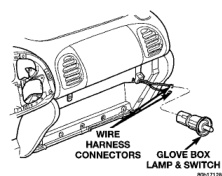
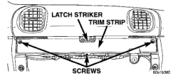

# REMOVAL AND INSTALLATION (Continued)

### GLOVE BOX LAMP AND SWITCH

**WARNING: ON VEHICLES EQUIPPED WITH AIRBAGS, REFER TO GROUP 8M - PASSIVE RESTRAINT SYSTEMS BEFORE ATTEMPTING ANY STEERING WHEEL, STEERING COLUMN, OR INSTRUMENT PANEL COMPONENT DIAGNOSIS OR SERVICE. FAILURE TO TAKE THE PROPER PRECAUTIONS COULD RESULT IN ACCIDENTAL AIRBAG DEPLOYMENT AND POSSIBLE PERSONAL INJURY.**

(1) Disconnect and isolate the battery negative cable.

(2) Remove the glove box from the instrument panel. See Glove Box in the Removal and Installation section of this group for the procedures.

(3) Reach through and above the instrument panel glove box opening to unplug the two wire harness connectors from the glove box lamp and switch (Fig. 21).

*Fig. 21 Glove Box Lamp and Switch Remove/Install*

(4) Reach through and above the instrument panel glove box opening to depress the retaining tabs on the top and bottom of the glove box lamp and switch housing.

(5) While holding the retaining tabs depressed, push the glove box lamp and switch unit out through the hole in the mounting bracket on the instrument panel glove box opening upper reinforcement.

(6) Reverse the removal procedures to install.

### GLOVE BOX OPENING UPPER TRIM STRIP

**WARNING: ON VEHICLES EQUIPPED WITH AIRBAGS, REFER TO GROUP 8M - PASSIVE RESTRAINT SYSTEMS BEFORE ATTEMPTING ANY STEERING WHEEL, STEERING COLUMN, OR INSTRUMENT PANEL COMPONENT DIAGNOSIS OR SERVICE. FAILURE TO TAKE THE PROPER PRECAUTIONS COULD RESULT IN ACCIDENTAL AIRBAG DEPLOYMENT AND POSSIBLE PERSONAL INJURY.**

(1) Disconnect and isolate the battery negative cable.

(2) Open the glove box.

(3) Remove the three screws that secure the trim strip to the glove box opening upper reinforcement (Fig. 22).

*Fig. 22 Glove Box Opening Upper Trim Strip Remove/Install*

(4) Remove the trim strip from the instrument panel.

(5) Reverse the removal procedures to install. Tighten the mounting screws to 2.2 N-m (20 in. lbs.).

### GLOVE BOX LATCH STRIKER

**WARNING: ON VEHICLES EQUIPPED WITH AIRBAGS, REFER TO GROUP 8M - PASSIVE RESTRAINT SYSTEMS BEFORE ATTEMPTING ANY STEERING WHEEL, STEERING COLUMN, OR INSTRUMENT PANEL COMPONENT DIAGNOSIS OR SERVICE. FAILURE TO TAKE THE PROPER PRECAUTIONS COULD RESULT IN ACCIDENTAL AIRBAG DEPLOYMENT AND POSSIBLE PERSONAL INJURY.**

(1) Disconnect and isolate the battery negative cable.

(2) Remove the trim strip from the upper glove box opening. See Glove Box Opening Upper Trim Strip in the Removal and Installation section of this group for the procedures.

(3) Remove the two screws that secure the latch striker to the glove box opening upper reinforcement (Fig. 23).

(4) Reverse the removal procedures to install. Tighten the mounting screws to 2.2 N-m (20 in. lbs.).

---
*8E_Instrument_Panel_Systems - Page 34*
