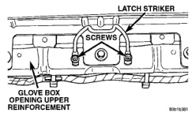

# REMOVAL AND INSTALLATION (Continued)

*Fig. 23 Glove Box Latch Striker Remove/Install*

### INSTRUMENT PANEL ASSEMBLY

**WARNING: ON VEHICLES EQUIPPED WITH AIRBAGS, REFER TO GROUP 8M - PASSIVE RESTRAINT SYSTEMS BEFORE ATTEMPTING ANY STEERING WHEEL, STEERING COLUMN, OR INSTRUMENT PANEL COMPONENT DIAGNOSIS OR SERVICE. FAILURE TO TAKE THE PROPER PRECAUTIONS COULD RESULT IN ACCIDENTAL AIRBAG DEPLOYMENT AND POSSIBLE PERSONAL INJURY.**

(1) Place the front wheels in the straight-ahead position.

(2) Disconnect and isolate the battery negative cable.

(3) Remove the Airbag Control Module (ACM) and bracket from the floor panel transmission tunnel. Refer to Airbag Control Module in the Removal and Installation section of Group 8M - Passive Restraint Systems for the procedures.

(4) Remove the trim panels from the left and right cowl side inner panels. Refer to Group 23 - Body for the procedures.

(5) Remove the steering column opening cover and knee blocker from the instrument panel. See Steering Column Opening Cover and Knee Blocker in the Removal and Installation section of this group for the procedures.

(6) Remove the steering column from the vehicle. Refer to Group 19 - Steering for the procedures.

(7) From under the driver side of the instrument panel:

- (a) Disconnect the park brake release handle linkage rod from the park brake mechanism on the left cowl side inner panel. See Park Brake Release Handle in the Removal and Installation section of this group for the procedures.
- (b) Unplug the wire harness connector from the park brake switch on the park brake mechanism.
- (c) Unplug the three junction block wire harness connectors that are closest to the dash panel. See Junction Block in the Removal and Installation section of this group for more information.
- (d) Remove the screw in the center of the instrument panel to bulkhead wire harness connector and unplug the connector.
- (e) Unplug the instrument panel to door wire harness connector located directly below the bulkhead wire harness connector.
- (f) If the vehicle is equipped with the Infinity sound system option, unplug the Infinity wire harness connector located on the outboard side of the bulkhead wire harness connector.
- (g) Unplug the wire harness connector from the stop lamp switch.
- (h) Unplug the heater and air conditioner vacuum harness connector located near the inboard end of the heater-A/C housing.
- (i) Remove the two screws that secure the inside hood latch release handle to the instrument panel lower reinforcement and lower the release handle to the floor.

(8) From under the passenger side of the instrument panel, disconnect the radio antenna coaxial cable connector. Refer to Antenna in the Removal and Installation section of Group 8F - Audio Systems for the procedures.

(9) Loosen the right and left instrument panel cowl side roll-down bracket screws about 13 mm (0.50 inch) (Fig. 24).

(10) Remove the five screws that secure the top of the instrument panel to the top of the dash panel, removing the center screw last.

(11) Roll down the instrument panel and install a temporary hook in the center hole on top of the instrument panel. Secure the other end of the hook to the center hole in the top of the dash panel. The hook should support the instrument panel in its rolled down position about 46 cm (18 inches) from the dash panel.

(12) With the instrument panel supported in the roll-down position, reach over the passenger side end of the instrument panel to:

- (a) Unplug the two wire harness connectors located on the heater-A/C housing.
- (b) Disconnect the temperature control cable flag retainer from the top of the heater-A/C housing and pull the cable core adjuster clip off of the blend-air door lever. Refer to Temperature Control Cable in the Removal and Installation section of Group 24 - Heating and Air Conditioning for the procedures.

(13) With the aid of an assistant, remove the temporary hook and lift the instrument panel assembly off of the roll-down bracket screws and remove it from the vehicle.

---
*8E_Instrument_Panel_Systems - Page 35*
