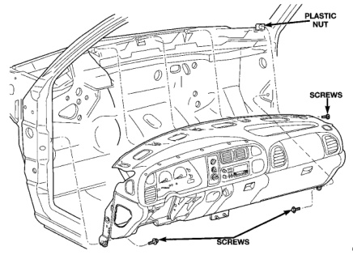
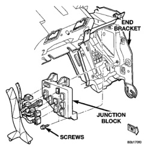

# REMOVAL AND INSTALLATION (Continued)

*Fig. 25 Instrument Panel Assembly Remove/Install*

*Fig. 24 Instrument Panel Assembly Remove/Install*

(14) Reverse the removal procedures to install. Tighten the mounting hardware as follows:

- Instrument panel top to dash panel screws - 3 N-m (28 in. lbs.)
- Instrument panel roll-down screws - 12 N-m (105 in. lbs.)

### JUNCTION BLOCK

**WARNING: ON VEHICLES EQUIPPED WITH AIRBAGS, REFER TO GROUP 8M - PASSIVE RESTRAINT SYSTEMS BEFORE ATTEMPTING ANY STEERING WHEEL, STEERING COLUMN, OR INSTRUMENT PANEL COMPONENT DIAGNOSIS OR SERVICE. FAILURE TO TAKE THE PROPER PRECAUTIONS COULD RESULT IN ACCIDENTAL AIRBAG DEPLOYMENT AND POSSIBLE PERSONAL INJURY.**

(1) Disconnect and isolate the battery negative cable.

(2) Roll down, but do not remove the instrument panel. See Instrument Panel Assembly in the Removal and Installation section of this group for the procedures.

(3) Reach through the outboard side of the instrument panel steering column opening to access and unplug all of the wire harness connectors from the junction block cavities (Fig. 25).

*Fig. 26 Junction Block Remove/Install*

*Fig. 25 Junction Block Remove/Install*

---
*8E_Instrument_Panel_Systems - Page 36*
