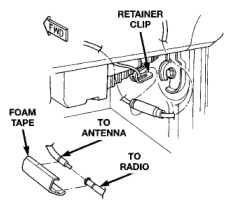
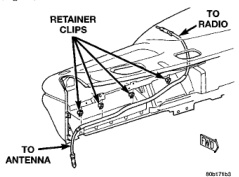

# AUDIO SYSTEMS

## REMOVAL AND INSTALLATION (Continued)

- (5) Remove the speaker from the door.
- (6) Reverse the removal procedures to install. Tighten the speaker mounting screws to 4 N-m (35 in. lbs.).

### ANTENNA

**WARNING: ON VEHICLES EQUIPPED WITH AIRBAGS, REFER TO GROUP 8M - PASSIVE RESTRAINT SYSTEMS BEFORE ATTEMPTING ANY STEERING WHEEL, STEERING COLUMN, OR INSTRUMENT PANEL COMPONENT DIAGNOSIS OR SERVICE. FAILURE TO TAKE THE PROPER PRECAUTIONS COULD RESULT IN ACCIDENTAL AIRBAG DEPLOYMENT AND POSSIBLE PERSONAL INJURY.**

- (1) Disconnect and isolate the battery negative cable.
- (2) Reach under the passenger side of the instrument panel near the right cowl side inner panel to disengage the coaxial cable connector from the retainer clip located on the bottom of the heater-A/C housing (Fig. 10).

*Fig. 10 Antenna Coaxial Cable Connector*

- (3) Remove the foam tape to access the coaxial cable connector. Unplug the connector by pulling it apart while twisting the metal connector halves. Do not pull on the cable.
- (4) Securely tie a suitable length of cord or twine to the connector on the end of the coaxial cable half that is being removed from the vehicle. This cord will be used to pull or "fish" the cable back into position during reinstallation. To remove the radio half of the antenna coaxial cable, go to Step 5. To remove the antenna half of the antenna coaxial cable, go to Step 9.
- (5) Remove the glove box from the instrument panel. Refer to Glove Box in the Removal and Installation section of Group 8E - Instrument Panel Systems for the procedures.
- (6) Reach through the glove box opening to disengage the radio half of the coaxial cable from the retainer clips on the back of the instrument panel (Fig. 11).

*Fig. 11 Antenna Cable Routing*

- (7) Remove the radio from the instrument panel. See Radio in the Removal and Installation section of this group for the procedures.
- (8) Remove the radio half of the antenna coaxial cable from the instrument panel.
- (9) Reach above the Powertrain Control Module (PCM) on the right side of the dash panel in the engine compartment to disengage the antenna coaxial cable grommet from the hole in the dash panel (Fig. 12).
- (10) Pull the antenna coaxial cable out of the passenger compartment and into the engine compartment through the hole in the dash panel.
- (11) Raise the sleeve on the antenna mast far enough to access and unscrew the antenna mast from the antenna body (Fig. 13).
- (12) Remove the antenna cap nut using an antenna nut wrench (Special Tool C-4816) (Fig. 14).
- (13) Remove the antenna adapter from the top of the fender.
- (14) Lower the antenna body and cable assembly through the top of the fender.
- (15) Pull the antenna body and cable out through the opening between the right cowl side outer panel and the top of the fender, while feeding the antenna coaxial cable out of the engine compartment through the hole in the right cowl side reinforcement.

---
*8F_Audio_Systems - Page 10*
