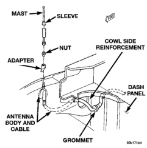
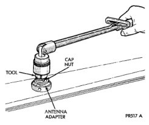
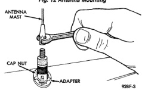
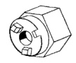

# AUDIO SYSTEMS

## REMOVAL AND INSTALLATION (Continued)

*Fig. 12 Antenna Mounting*

*Fig. 13 Antenna Mast Remove/Install - Typical*

- (16) Remove the antenna body and cable from the vehicle.

*Fig. 14 Antenna Cap Nut Remove/Install - Typical*

- (17) Reverse the removal procedures to install. Tighten the antenna cap nut to 8 N-m (70 in. lbs.). Tighten the antenna mast to 3.3 N-m (30 in. lbs.).

## SPECIAL TOOLS

### ANTENNA

*Fig. 4*

*Antenna Nut Wrench C-4816*

---
*8F_Audio_Systems - Page 11*
