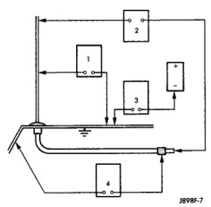

# AUDIO SYSTEMS

## DIAGNOSIS AND TESTING (Continued)

connector. Check for battery voltage at the amplified speaker (+) circuit cavity of the choke and relay wire harness connector. There should be zero volts. Turn the ignition and radio switches to the On position. There should now be battery voltage. If OK, repair the circuits from the choke and relay wire harness connector to the speaker amplifiers as required. If not OK, replace the faulty choke and relay.

### ANTENNA

**WARNING: ON VEHICLES EQUIPPED WITH AIRBAGS, REFER TO GROUP 8M - PASSIVE RESTRAINT SYSTEMS BEFORE ATTEMPTING ANY STEERING WHEEL, STEERING COLUMN, OR INSTRUMENT PANEL COMPONENT DIAGNOSIS OR SERVICE. FAILURE TO TAKE THE PROPER PRECAUTIONS COULD RESULT IN ACCIDENTAL AIRBAG DEPLOYMENT AND POSSIBLE PERSONAL INJURY.**

The following four tests are used to diagnose the antenna with an ohmmeter:

- Test 1 - Mast to ground test
- Test 2 - Tip-of-mast to tip-of-conductor test
- Test 3 - Body ground to battery ground test
- Test 4 - Body ground to coaxial shield test.

The ohmmeter test lead connections for each test are shown in Antenna Tests (Fig. 1).

**NOTE: This model has a two-piece antenna coaxial cable. Tests 2 and 4 must be conducted in two steps to isolate a coaxial cable problem; from the coaxial cable connection under the right end of the instrument panel near the right cowl side inner panel to the antenna base, and then from the coaxial cable connection to the radio chassis connection.**

#### TEST 1

Test 1 determines if the antenna mast is insulated from the base. Proceed as follows:

- (1) Unplug the antenna coaxial cable connector from the radio chassis and isolate.
- (2) Connect one ohmmeter test lead to the tip of the antenna mast. Connect the other test lead to the antenna base. Check for continuity.
- (3) There should be no continuity. If continuity is found, replace the faulty or damaged antenna base and cable assembly.

#### TEST 2

Test 2 checks the antenna for an open circuit as follows:

- (1) Unplug the antenna coaxial cable connector from the radio chassis.

*Fig. 1 Antenna Tests*

- (2) Connect one ohmmeter test lead to the tip of the antenna mast. Connect the other test lead to the center pin of the antenna coaxial cable connector.
- (3) Continuity should exist (the ohmmeter should only register a fraction of an ohm). High or infinite resistance indicates damage to the base and cable assembly. Replace the faulty base and cable, if required.

#### TEST 3

Test 3 checks the condition of the vehicle body ground connection. This test should be performed with the battery positive cable removed from the battery. Disconnect both battery cables, the negative cable first. Reconnect the battery negative cable and perform the test as follows:

- (1) Connect one ohmmeter test lead to the vehicle fender. Connect the other test lead to the battery negative post.
- (2) The resistance should be less than one ohm.
- (3) If the resistance is more than one ohm, check the braided ground strap connected to the engine and the vehicle body for being loose, corroded, or damaged. Repair the ground strap connection, if required.

#### TEST 4

Test 4 checks the condition of the ground between the antenna base and the vehicle body as follows:

- (1) Connect one ohmmeter test lead to the vehicle fender. Connect the other test lead to the outer crimp on the antenna coaxial cable connector.
- (2) The resistance should be less than one ohm.
- (3) If the resistance is more than one ohm, clean and/or tighten the antenna base to fender mounting hardware.

---
*8F_Audio_Systems - Page 6*
