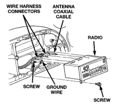
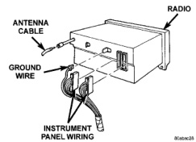

# AUDIO SYSTEMS

## DIAGNOSIS AND TESTING (Continued)

### RADIO FREQUENCY INTERFERENCE

**WARNING: ON VEHICLES EQUIPPED WITH AIRBAGS, REFER TO GROUP 8M - PASSIVE RESTRAINT SYSTEMS BEFORE ATTEMPTING ANY STEERING WHEEL, STEERING COLUMN, OR INSTRUMENT PANEL COMPONENT DIAGNOSIS OR SERVICE. FAILURE TO TAKE THE PROPER PRECAUTIONS COULD RESULT IN ACCIDENTAL AIRBAG DEPLOYMENT AND POSSIBLE PERSONAL INJURY.**

Inspect the ground connections at the following:

- Blower motor
- Electric fuel pump
- Generator
- Ignition module
- Wiper motor
- Antenna coaxial ground
- Radio ground
- Body-to-engine braided ground strap (if the vehicle is so equipped).

Clean, tighten, or repair the connections as required.

Also inspect the following secondary ignition system components, as described in Group 8D - Ignition Systems:

- Spark plug wire routing and condition
- Distributor cap and rotor
- Ignition coil
- Spark plugs.

Reroute the spark plug wires or replace the faulty components as required.

## REMOVAL AND INSTALLATION

### RADIO

**WARNING: ON VEHICLES EQUIPPED WITH AIRBAGS, REFER TO GROUP 8M - PASSIVE RESTRAINT SYSTEMS BEFORE ATTEMPTING ANY STEERING WHEEL, STEERING COLUMN, OR INSTRUMENT PANEL COMPONENT DIAGNOSIS OR SERVICE. FAILURE TO TAKE THE PROPER PRECAUTIONS COULD RESULT IN ACCIDENTAL AIRBAG DEPLOYMENT AND POSSIBLE PERSONAL INJURY.**

- (1) Disconnect and isolate the battery negative cable.
- (2) Remove the cluster bezel from the instrument panel. Refer to Cluster Bezel in the Removal and Installation section of Group 8E - Instrument Panel Systems for the procedures.
- (3) Remove the two screws that secure the radio to the instrument panel (Fig. 2).

*Fig. 2 Radio Remove/Install*

- (4) Pull the radio out from the instrument panel far enough to access the wire harness connectors and the antenna coaxial cable connector (Fig. 3).

*Fig. 3 Radio Connections - Typical*

- (5) Unplug the wire harness connectors and the antenna coaxial cable connector from the rear of the radio.
- (6) If so equipped, remove the screw that secures the ground wire to the back of the radio chassis.
- (7) Remove the radio from the instrument panel.
- (8) Reverse the removal procedures to install. Tighten the radio ground wire screw to 7 N-m (65 in. lbs.). Tighten the radio mounting screws to 5 N-m (45 in. lbs.).

---
*8F_Audio_Systems - Page 7*
