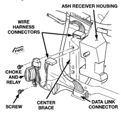
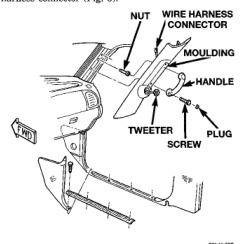

# AUDIO SYSTEMS

## REMOVAL AND INSTALLATION (Continued)

### FILTER, CHOKE, AND SPEAKER RELAY

- (1) Disconnect and isolate the battery negative cable.
- (2) From the driver side of the vehicle, reach under the instrument panel near the 16-way data link connector and inboard of the ash receiver to unplug the filter, choke, and speaker relay wire harness connector from the instrument panel wire harness (Fig. 4).

*Fig. 4 Filter, Choke, and Speaker Relay Remove/Install*

- (3) Remove the two screws that secure the filter, choke, and speaker relay mounting bracket to the instrument panel center brace.
- (4) Remove the filter, choke, and speaker relay unit from under the instrument panel.
- (5) Reverse the removal procedures to install. Tighten the mounting screws to 2.7 N-m (24 in. lbs.).

### SPEAKER

#### A-PILLAR TWEETER

The A-pillar-mounted tweeters are used only with the optional Infinity premium speaker package.

- (1) Disconnect and isolate the battery negative cable.
- (2) If the vehicle is so equipped, remove the grab handle from the A-pillar. Refer to Group 23 - Body for the procedures.
- (3) Disengage the garnish moulding retainers from the A-pillar. Refer to Group 23 - Body for the procedures.
- (4) Pull the garnish moulding away from the A-pillar far enough to access and unplug the tweeter wire harness connector (Fig. 5).

*Fig. 5 A-Pillar Tweeter Remove/Install*

- (5) Remove the garnish moulding from the A-pillar.
- (6) Disengage the tweeter wire harness retainers from the heat stakes on the back of the A-pillar garnish moulding.
- (7) Unsnap the tweeter from the A-pillar garnish moulding mounting hole by pushing out on the tweeter from the inside of the moulding.
- (8) Reverse the removal procedures to install. Use a suitable tape or adhesive to secure the tweeter wire harness to the inside of the garnish moulding.

#### FRONT DOOR

- (1) Disconnect and isolate the battery negative cable.
- (2) Remove the inside trim panel from the front door. Refer to Group 23 - Body for the procedures.
- (3) Remove the screws that secure the speaker near the front of the front door inner panel (Fig. 6).
- (4) Pull the speaker away from the inner door panel far enough to access and unplug the speaker wire harness connector.
- (5) Remove the speaker from the door.
- (6) Reverse the removal procedures to install. Tighten the speaker mounting screws to 4 N-m (35 in. lbs.).

#### REAR CAB SIDE PANEL

- (1) Disconnect and isolate the battery negative cable.

---
*8F_Audio_Systems - Page 8*
