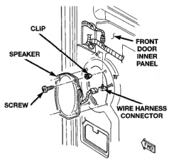
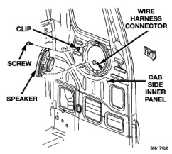
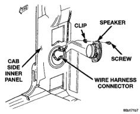
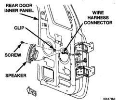

# AUDIO SYSTEMS

## REMOVAL AND INSTALLATION (Continued)

*Fig. 6 Front Door Speaker Remove/Install*

- (2) Remove the quarter inner trim panel from the rear cab side. Refer to Group 23 - Body for the procedures.
- (3) Remove the screws that secure the speaker to the rear cab side inner panel (Fig. 7) or (Fig. 8).

*Fig. 7 Rear Speaker Remove/Install - Standard Cab*

- (4) Pull the speaker away from the rear cab side inner panel far enough to access and unplug the wire harness connector from the speaker.
- (5) Remove the speaker from the rear cab side inner panel.

*Fig. 8 Rear Speaker Remove/Install - Club Cab*

- (6) Reverse the removal procedures to install. Tighten the speaker mounting screws to 4 N-m (35 in. lbs.).

#### REAR DOOR

- (1) Disconnect and isolate the battery negative cable.
- (2) Remove the inside trim panel from the rear door. Refer to Group 23 - Body for the procedures.
- (3) Remove the screws that secure the speaker near the rear of the rear door inner panel (Fig. 9).

*Fig. 9 Rear Door Speaker Remove/Install - Quad Cab*

- (4) Pull the speaker away from the inner door panel far enough to access and unplug the wire harness connector from the speaker.

---
*8F_Audio_Systems - Page 9*
