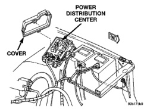
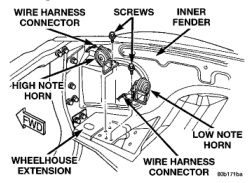

*Fig. 2 Power Distribution Center*

4. Unplug the horn relay from the PDC.

5. Install the horn relay by aligning the relay terminals with the cavities in the PDC and pushing the relay firmly into place.

6. Install the PDC cover.

7. Connect the battery negative cable.

8. Test the relay operation.

### HORN SWITCH

**WARNING: ON VEHICLES EQUIPPED WITH A DRIVER SIDE AIRBAG, THE HORN SWITCH IS INTEGRAL TO THE AIRBAG MODULE TRIM COVER. SERVICE OF THIS COMPONENT SHOULD BE PERFORMED ONLY BY CHRYSLER-TRAINED AND AUTHORIZED DEALER SERVICE TECHNICIANS. FAILURE TO TAKE THE PROPER PRECAUTIONS OR TO FOLLOW THE PROPER PROCEDURES COULD RESULT IN ACCIDENTAL, INCOMPLETE, OR IMPROPER AIRBAG DEPLOYMENT AND POSSIBLE PERSONAL INJURY. REFER TO DRIVER SIDE AIRBAG TRIM COVER AND HORN SWITCH IN THE REMOVAL AND INSTALLATION SECTION OF GROUP 8M - PASSIVE RESTRAINT SYSTEMS FOR THE SERVICE PROCEDURES.**

### HORN

1. Disconnect and isolate the battery negative cable.

2. Unplug the wire harness connector from the horn (Fig. 3).

*Fig. 3 Horns Remove/Install*

3. Remove the screw that secures the horn mounting bracket to the wheelhouse front extension.

4. Remove the horn and mounting bracket from the wheelhouse front extension.

5. Reverse the removal procedures to install. Tighten the mounting screw to 11 N-m (95 in. lbs.).

---
*8G Horn Systems - Page 4*
