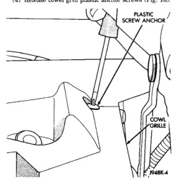
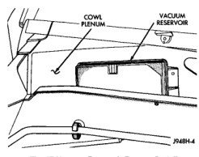

# REMOVAL AND INSTALLATION (Continued)

(4) Release cowl grill plastic anchor screws (Fig. 16).

*Fig. 16 Plastic Anchor Screws Remove/Install*

(5) Lift cowl plenum cover/grille panel from vehicle far enough to access vacuum reservoir.

(6) Disconnect vacuum supply line from vacuum reservoir (Fig. 17).

(7) Remove 2 vacuum reservoir mounting screws.

(8) Remove vacuum reservoir from vehicle.

#### INSTALLATION

(1) Install vacuum reservoir and two mounting screws. Tighten screws to 2.2 N-m (20 in. lbs.) torque.

(2) Connect vacuum supply hose to vacuum reservoir.

*Fig. 17 Vacuum Reservoir Remove/Install*

(3) Position cowl plenum cover/grille panel to vehicle.

(4) Install and tighten cowl cover fasteners to vehicle body.

(5) Install rubber weather-strip at front edge of cowl grill.

(6) Install windshield wiper arms. Refer to Group 8K, Wiper and Washer Systems.

(7) Connect negative battery cable.

## SPECIFICATIONS

### TORQUE CHART

| Description | Torque |
|-------------|--------|
| Servo Mounting Bracket Nuts | 8.5 N-m (75 in. lbs.) |
| Switch Module Mounting Screws | 1.5 N-m (15 in. lbs.) |
| Vacuum Reservoir Mounting Screws | 2.2 N-m (20 in. lbs.) |

---
*8H - Speed Control System - Page 10*
