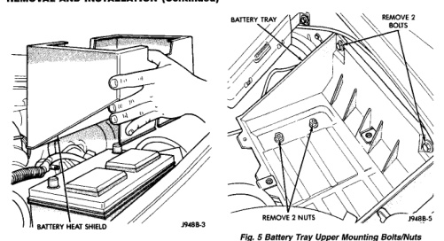
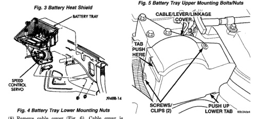

# BR - SPEED CONTROL SYSTEM - 8H-3

## REMOVAL AND INSTALLATION (Continued)

*Fig. 6 Battery Heat Shield]*
- Battery Heat Shield
- 7M8B-3

*Fig. 7 Battery Tray Lower Mounting Nuts]*
- Battery Tray
- Speed Control Servo
- 7M8B-1A

*Fig. 6 Battery Tray Upper Mounting Bolts/Nuts]*
- Battery Tray
- Remove 2 Bolts
- Remove 2 Nuts
- 7M8B-5

*Fig. 7 Cable/Lever/Throttle Linkage Cover]*
- Cable/Lever/Linkage Cover
- Tab
- Push Clips
- Screws/Clips (2)
- Push Up Lower Tab
- Bracket

(8) Remove cable cover (Fig. 6). Cable cover is attached with 2 Phillips screws, 2 plastic retention clips and 2 push tabs (Fig. 6). Remove 2 Phillips screws and carefully pry out 2 retention clips. After clip removal, push rearward on front tab, and upward on lower tab for cover removal.

(9) Using finger pressure only, disconnect end of servo cable from throttle lever pin by pulling forward on connector while holding lever rearward (Fig. 7). DO NOT try to pull connector off perpendicular to lever pin. Connector will be broken.