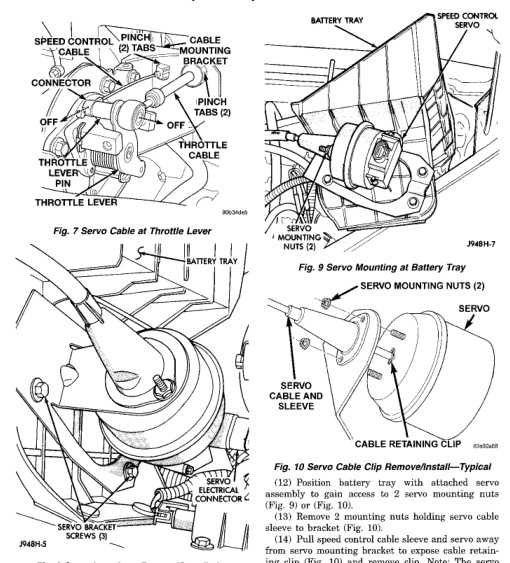

# 8H-4 - SPEED CONTROL SYSTEM - BR

## REMOVAL AND INSTALLATION (Continued)

*Fig. 8 Servo Cable at Throttle Lever]*
- Speed Control Cable
- Connector
- Off
- Throttle Lever Pin
- Throttle Lever
- Pinch (2) Tabs
- Mounting Bracket
- Pinch Tabs (2)
- Off
- Throttle Cable
- 9B2-5A/8

*Fig. 8 Servo Location—Removal/Installation]*
- Battery Tray
- Servo Bracket Screws
- Electrical Connector
- 7M8B-5

[Figure: Fig. 9 Servo Mounting at Battery Tray]
- Battery Tray
- Speed Control Servo
- Mounting Nuts (2)
- 7M8H-7

[Figure: Fig. 10 Servo Cable Clip Remove/Install—Typical]
- Servo Mounting Nuts (2)
- Servo
- Servo Cable and Sleeve
- Cable Retaining Clip
- 9H2B/48

(10) Position battery tray up far enough for access to speed control servo electrical connector and vacuum line.

(11) Disconnect electrical connector and vacuum line at servo.

(12) Position battery tray with attached servo assembly to gain access to 2 servo mounting nuts (Fig. 9) or (Fig. 10).

(13) Remove 2 mounting nuts holding servo cable sleeve to bracket (Fig. 10).

(14) Pull speed control cable sleeve and servo away from servo mounting bracket to expose cable retaining clip (Fig. 10) and remove clip. Note: The servo mounting bracket displayed in (Fig. 10) is a typical bracket and may or may not be applicable to this model vehicle.

(15) Remove servo from mounting bracket.

### INSTALLATION

(1) Position servo to mounting bracket.