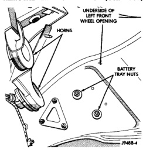
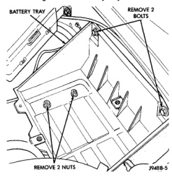

# REMOVAL AND INSTALLATION (Continued)

*Fig. 9 Forward Battery Tray Nuts*

*Fig. 10 Battery Tray Mounting*

#### INSTALLATION

(1) Position servo to mounting bracket.

(2) Align hole in cable connector with hole in servo pin. Install cable-to-servo retaining clip.

(3) Insert servo studs through holes in servo mounting bracket.

(4) Insert servo studs through holes in servo cable sleeve.

(5) Install servo mounting nuts and tighten to 8.5 N-m (75 in. lbs.) torque.

(6) Connect vacuum line to servo.

(7) Connect electrical connector to servo terminals.

(8) Connect servo cable to throttle body. Refer to Servo Cable Removal/Installation in this group.

(9) Install battery tray. Tighten all battery tray mounting hardware to 16 N-m (140 in. lbs.) torque.

(10) Position battery into battery tray.

(11) If equipped, install battery heat shield.

(12) Install battery holddown clamp. Tighten bolt to 4 N-m (35 in. lbs.) torque.

(13) Connect negative battery cable(s) to battery(s).

(14) Before starting engine, operate accelerator pedal to check for any binding.

### SPEED CONTROL SWITCHES

#### REMOVAL

**WARNING: BEFORE BEGINNING ANY AIRBAG SYSTEM COMPONENT REMOVAL OR INSTALLATION, REMOVE AND ISOLATE THE NEGATIVE (-) CABLE FROM THE BATTERY. THIS IS THE ONLY SURE WAY TO DISABLE THE AIRBAG SYSTEM. THEN WAIT TWO MINUTES FOR SYSTEM CAPACITOR TO DISCHARGE BEFORE FURTHER SYSTEM SERVICE. FAILURE TO DO THIS COULD RESULT IN ACCIDENTAL AIRBAG DEPLOYMENT AND POSSIBLE INJURY.**

(1) Disconnect and isolate negative battery cable.

(2) Remove airbag module. Refer to Group 8M, Passive Restraint Systems for procedures.

(3) Remove switch-to-steering wheel mounting screws (Fig. 11).

(4) Remove switch.

(5) Remove electrical connector at switch.

#### INSTALLATION

(1) Install electrical connector to switch.

(2) Install switch and mounting screws.

(3) Tighten screws to 1.5 N-m (14 in. lbs.) torque.

(4) Install airbag module. Refer to Group 8M, Passive Restraint Systems for procedures.

(5) Connect negative battery cable.

### STOP LAMP SWITCH

Refer to Stop Lamp Switch in Group 5, Brakes for removal/installation and adjustment procedures.

---
*8H - Speed Control System - Page 7*
