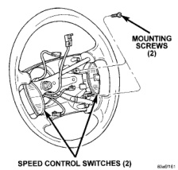
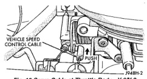
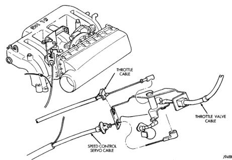

# REMOVAL AND INSTALLATION (Continued)

*Fig. 11 Speed Control Switches*

### SERVO CABLE

#### REMOVAL

(1) Disconnect negative battery cable at battery. Diesel Engine: Remove both negative battery cables at both batteries.

(2) Remove air cleaner (all except V-10 and diesel engine).

(3) Using finger pressure only, remove speed control cable connector at bellcrank by pushing connector off the bellcrank pin (Fig. 12), (Fig. 13) or (Fig. 14). DO NOT try to pull connector off perpendicular to the bellcrank pin. Connector will be broken.

*Fig. 12 Servo Cable at Throttle Body-V-6/V-8 Engine*

(4) Squeeze 2 tabs on sides of speed control cable at throttle body mounting bracket (locking plate) and push out of bracket.

(5) Remove servo cable from servo. Refer to Speed Control Servo Removal/Installation in this group.

*Fig. 13 Servo Cable at Throttle Body-V-10 Engine*

---
*8H - Speed Control System - Page 8*
