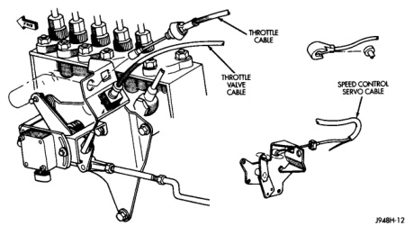
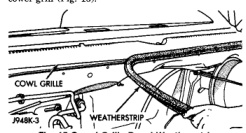

# REMOVAL AND INSTALLATION (Continued)

*Fig. 14 Servo Cable-Diesel Engine*

#### INSTALLATION

(1) Install end of cable to speed control servo. Refer to Speed Control Servo Removal/Installation.

(2) Install cable into throttle body mounting bracket (injection pump bracket on diesel engine). Cable snaps into bracket.

(3) Install speed control cable connector at throttle body bellcrank pin (injection pump bellcrank pin on diesel engine). Connector snaps onto pin.

(4) Connect negative battery cable(s) to battery(s).

(5) Before starting engine, operate accelerator pedal to check for any binding.

### VACUUM RESERVOIR

The vacuum reservoir is located under the plastic cowl plenum cover at lower base of windshield. The vacuum reservoir is not used if equipped with a diesel engine.

#### REMOVAL

(1) Disconnect and isolate battery negative cable.

(2) Remove both windshield wiper arm/blade assemblies. Refer to Group 8K, Wiper and Washer Systems.

(3) Remove rubber weather-strip at front edge of cowl grill (Fig. 15).

*Fig. 15 Cowl Grille Panel Weather-strip*

---
*8H - Speed Control System - Page 9*
