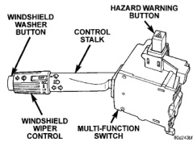

# DESCRIPTION AND OPERATION (Continued)

- Turn signals
- Hazard warning
- Headlamp beam selection
- Headlamp optical horn
- Windshield wipers
- Windshield washers

The information contained in this group addresses only the switch functions for the turn signal and hazard warning systems. For information relative to the other switch functions, refer to the proper group. However, the multi-function switch cannot be repaired. If any function of the multi-function switch is faulty, or if the switch is damaged, the entire switch assembly must be replaced.

*Fig. 2 Multi-Function Switch*

### TURN SIGNAL INDICATOR LAMP

The turn signal indicator lamps are located in the instrument cluster. They flash with the exterior turn signal lamps to give the driver a visual indication that a turn signal or the hazard warning system is operating. Refer to Turn Signal Indicator Lamp in Group 8E - Instrument Panel Systems for diagnosis or service of these lamps.

### TURN SIGNAL LAMP

The exterior lamps in the turn signal and hazard warning circuits include the front park/turn signal, and the rear tail/stop/turn signal. Refer to Exterior Lamps in Group 8L - Lamps for diagnosis and service of the turn signal lamps.

## DIAGNOSIS AND TESTING

### INTRODUCTION

When diagnosing the turn signal or hazard warning circuits, remember that high generator output can burn out bulbs rapidly and repeatedly. If this is a problem on the vehicle being diagnosed, refer to Group 8C - Charging System for further diagnosis of a possible generator overcharging condition.

**WARNING: ON VEHICLES EQUIPPED WITH AIRBAGS, REFER TO GROUP 8M - PASSIVE RESTRAINT SYSTEMS BEFORE ATTEMPTING ANY STEERING WHEEL, STEERING COLUMN, OR INSTRUMENT PANEL COMPONENT DIAGNOSIS OR SERVICE. FAILURE TO TAKE THE PROPER PRECAUTIONS COULD RESULT IN ACCIDENTAL AIRBAG DEPLOYMENT AND POSSIBLE PERSONAL INJURY.**

For circuit descriptions and diagrams, refer to 8W-52 - Turn Signals in Group 8W - Wiring Diagrams.

### TURN SIGNAL AND HAZARD WARNING SYSTEMS

**WARNING: ON VEHICLES EQUIPPED WITH AIRBAGS, REFER TO GROUP 8M - PASSIVE RESTRAINT SYSTEMS BEFORE ATTEMPTING ANY STEERING WHEEL, STEERING COLUMN, OR INSTRUMENT PANEL COMPONENT DIAGNOSIS OR SERVICE. FAILURE TO TAKE THE PROPER PRECAUTIONS COULD RESULT IN ACCIDENTAL AIRBAG DEPLOYMENT AND POSSIBLE PERSONAL INJURY.**

(1) Turn the ignition switch to the On position. Actuate the turn signal lever or the hazard warning button. Observe the turn signal indicator lamp(s) in the instrument cluster. If the flash rate is very high, check for a turn signal bulb that is not lit or is very dimly lit. Repair the circuits to that lamp or replace the faulty bulb, as required. Test the operation of the turn signal and hazard warning systems again. If the turn signal indicator(s) fail to light, go to Step 2.

(2) Turn the ignition switch to the Off position. Check the turn signal fuse in the junction block and/or the hazard warning fuse in the Power Distribution Center (PDC). If OK, go to Step 3. If not OK, repair the shorted circuit or component as required and replace the faulty fuse(s).

(3) Turn the ignition switch to the On position to check for battery voltage at the turn signal fuse in the junction block; or, leave the ignition switch in the Off position to check for battery voltage at the hazard warning fuse in the PDC. If OK, go to Step 4. If not OK, repair the open circuit as required.

(4) Turn the ignition switch to the Off position. Disconnect and isolate the battery negative cable. Unplug the combination flasher from the junction block and replace it with a known good unit. Connect the battery negative cable. Test the operation of the turn signal and hazard warning systems. If OK, dis-

---
*8J - Turn Signal and Hazard Warning Systems - Page 3*
