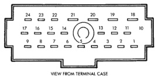

# DIAGNOSIS AND TESTING (Continued)

*Fig. 3 Multi-Function Switch Continuity*

card the faulty combination flasher. If not OK, remove the test flasher and go to Step 5.

(5) Turn the ignition switch to the On position. Check for battery voltage at the fused ignition switch output circuit cavity for the combination flasher in the junction block. If OK, go to Step 6. If not OK, repair the open circuit to the turn signal fuse as required.

(6) Turn the ignition switch to the Off position. Check for battery voltage at the fused B(+) circuit cavity for the combination flasher in the junction block. If OK, go to Step 7. If not OK, repair the open circuit to the hazard warning fuse as required.

(7) Disconnect and isolate the battery negative cable. Check for continuity between the ground circuit cavity for the combination flasher in the junction block and a good ground. There should be continuity. If OK, go to Step 8. If not OK, repair the circuit to ground as required.

(8) Unplug the multi-function switch wire harness connector as described in this group. Check for continuity between the combination flasher hazard signal circuit cavities in the junction block and in the multi-function switch wire harness connector. There should be continuity. If OK, go to Step 9. If not OK, repair the open circuit as required.

(9) Check for continuity between the combination flasher turn signal circuit cavities in the junction block and in the multi-function switch wire harness connector. There should be continuity. If OK, test the multi-function switch as described in this group. If not OK, repair the open circuit as required.

### MULTI-FUNCTION SWITCH

Perform the diagnosis of the hazard warning and/or turn signal systems as described in this group before testing the multi-function switch. For circuit descriptions and diagrams, refer to 8W-52 - Turn Signals in Group 8W - Wiring Diagrams.

**WARNING: ON VEHICLES EQUIPPED WITH AIRBAGS, REFER TO GROUP 8M - PASSIVE RESTRAINT SYSTEMS BEFORE ATTEMPTING ANY STEERING WHEEL, STEERING COLUMN, OR INSTRUMENT PANEL COMPONENT DIAGNOSIS OR SERVICE. FAILURE TO TAKE THE PROPER PRECAUTIONS COULD RESULT IN ACCIDENTAL AIRBAG DEPLOYMENT AND POSSIBLE PERSONAL INJURY.**

(1) Disconnect and isolate the battery negative cable. Unplug the multi-function switch wire harness connector.

(2) Using an ohmmeter, perform the switch continuity checks at the switch terminals as shown in the Multi-Function Switch Continuity chart (Fig. 3).

**Multi-Function Switch Continuity**

| TURN SIGNAL | HAZARD WARNING | CONTINUITY BETWEEN |
|-------------|----------------|-------------------|
| NEUTRAL | OFF | 12 AND 14 AND 15 |
| LEFT | OFF | 15 AND 16 AND 17 |
| LEFT | OFF | 12 AND 14 |
| LEFT | OFF | 22 AND 23 WITH OPTIONAL CORNER LAMPS |
| RIGHT | OFF | 11 AND 12 AND 17 |
| RIGHT | OFF | 14 AND 15 |
| RIGHT | OFF | 23 AND 24 WITH OPTIONAL CORNER LAMPS |
| NEUTRAL | ON | 11 AND 12 AND 13 AND 15 AND 16 |

---
*8J - Turn Signal and Hazard Warning Systems - Page 4*
