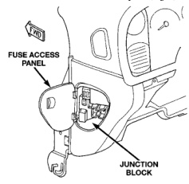
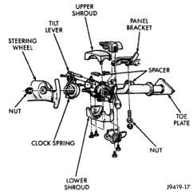

# DIAGNOSIS AND TESTING (Continued)

(3) If the switch fails any of the continuity checks, replace the faulty switch. If the switch is OK, repair the lighting circuits as required.

## REMOVAL AND INSTALLATION

### COMBINATION FLASHER

**WARNING: ON VEHICLES EQUIPPED WITH AIRBAGS, REFER TO GROUP 8M - PASSIVE RESTRAINT SYSTEMS BEFORE ATTEMPTING ANY STEERING WHEEL, STEERING COLUMN, OR INSTRUMENT PANEL COMPONENT DIAGNOSIS OR SERVICE. FAILURE TO TAKE THE PROPER PRECAUTIONS COULD RESULT IN ACCIDENTAL AIRBAG DEPLOYMENT AND POSSIBLE PERSONAL INJURY.**

(1) Disconnect and isolate the battery negative cable.

(2) Remove the fuse access panel by unsnapping it from the left end of the instrument panel (Fig. 4).

*Fig. 4 Junction Block*

(3) Unplug the combination flasher from the junction block.

(4) Install the combination flasher by aligning the flasher terminals with the cavities in the junction block and pushing the flasher firmly into place.

(5) Connect the battery negative cable.

(6) Test the flasher operation.

(7) Reinstall the fuse access panel.

### MULTI-FUNCTION SWITCH

**WARNING: ON VEHICLES EQUIPPED WITH AIRBAGS, REFER TO GROUP 8M - PASSIVE RESTRAINT SYSTEMS BEFORE ATTEMPTING ANY STEERING WHEEL, STEERING COLUMN, OR INSTRUMENT PANEL COMPONENT DIAGNOSIS OR SERVICE. FAILURE TO TAKE THE PROPER PRECAUTIONS COULD RESULT IN ACCIDENTAL AIRBAG DEPLOYMENT AND POSSIBLE PERSONAL INJURY.**

(1) Disconnect and isolate the battery negative cable.

(2) If the vehicle is so equipped, remove the tilt steering column lever.

(3) Remove both the upper and lower shrouds from the steering column (Fig. 5).

*Fig. 5 Steering Column Shrouds Remove/Install - Typical*

(4) Remove the lower fixed column shroud.

(5) Move the upper fixed column shroud far enough to access the rear of the multi-function switch (Fig. 6).

(6) Remove the tamper proof mounting screws (a Snap On tamper proof torx bit TTXR20B2 or equivalent is required) that secure the multi-function switch to the steering column.

(7) Gently pull the switch away from the steering column far enough to access and remove the multi-function switch wire harness connector screw.

---
*8J - Turn Signal and Hazard Warning Systems - Page 5*
