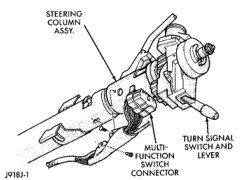

# REMOVAL AND INSTALLATION (Continued)

*Fig. 6 Multi-Function Switch Connector - Typical*

(8) Unplug the wire harness connector from the multi-function switch.

(9) Reverse the removal procedures to install. Tighten the fasteners as follows:

- Multi-function switch wire harness connector screw - 2 N-m (17 in. lbs.)
- Multi-function switch mounting screws - 2 N-m (17 in. lbs.)

---
*8J - Turn Signal and Hazard Warning Systems - Page 6*
