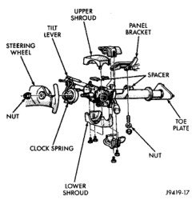
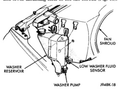
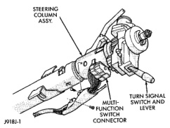

## REMOVAL AND INSTALLATION (Continued)

*Fig. 13 Steering Column Shrouds Remove/Install - Typical*

(5) Move the upper fixed column shroud far enough to access the rear of the multi-function switch (Fig. 14).

*Fig. 14 Multi-Function Switch Connector - Typical*

(6) Remove the tamper proof mounting screws (a Snap On tamper proof torx bit TTXR20B2 or equivalent is required) that secure the multi-function switch to the steering column.

(7) Gently pull the switch away from the steering column far enough to access and remove the multi-function switch wire harness connector screw.

(8) Unplug the wire harness connector from the multi-function switch.

(9) Reverse the removal procedures to install. Tighten the fasteners as follows:

- Multi-function switch wire harness connector screw - 2 N-m (17 in. lbs.)
- Multi-function switch mounting screws - 2 N-m (17 in. lbs.).

### WASHER SYSTEM

#### WASHER RESERVOIR

(1) Disconnect and isolate the battery negative cable.

(2) Drain the engine cooling system and remove the upper hose from the radiator. Refer to Group 7 - Cooling System for the procedures.

(3) Unplug the wire harness connectors from the washer pump and, if the vehicle is so equipped, the washer fluid level sensor.

(4) Remove the washer supply hose from the washer pump and drain the washer fluid from the reservoir into a clean container for reuse.

(5) While pulling the reservoir away from the fan shroud, lift the reservoir upwards far enough to disengage the reservoir mounting tabs from the upper and lower mounting slots in the fan shroud (Fig. 15).

*Fig. 15 Washer Reservoir Remove/Install*

(6) Remove the reservoir from the engine compartment.

(7) Reverse the removal procedures to install.

#### WASHER PUMP

(1) Disconnect and isolate the battery negative cable.

(2) Unplug the wire harness connector from the washer pump.

(3) Remove the washer supply hose from the washer pump and drain the washer fluid from the reservoir into a clean container for reuse.

(4) Using a trim stick or another suitable wide flat-bladed tool, gently pry the barbed inlet nipple of the washer pump out of the rubber grommet seal in

---
*8K Wiper and Washer Systems - Page 10*
