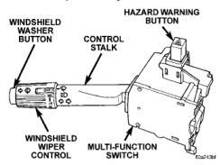

## DESCRIPTION AND OPERATION (Continued)

The information contained in this group addresses only the switch functions for the windshield wiper and washer systems. For information relative to the other switch functions, refer to the proper group. However, the multi-function switch cannot be repaired. If any function of the multi-function switch is faulty, or if the switch is damaged, the entire switch assembly must be replaced.

*Fig. 1 Multi-Function Switch*

### CENTRAL TIMER MODULE

Two versions of the Central Timer Module (CTM) are available on this vehicle, a base version and a high-line version. The base version of the CTM is used on base models of the vehicle. It is also sometimes referred to as the Integrated Electronic Module (IEM). The base version of the CTM combines the functions of a chime/buzzer module, an intermittent wipe module, and an ignition lamp time delay relay in a single unit.

The high-line version of the CTM is used on high-line vehicles. The high-line CTM provides all of the functions of the base version CTM, but also is used to control and integrate many of the additional electronic functions and features included on the high-line models. The high-line version of the CTM contains a central processing unit and interfaces with other modules in the vehicle on the Chrysler Collision Detection (CCD) data bus network.

The CCD data bus network allows the sharing of sensor information. This helps to reduce wire harness complexity, reduce internal controller hardware, and reduce component sensor current loads. At the same time, this system provides increased reliability, enhanced diagnostics, and allows the addition of many new feature capabilities.

Both the base and the high-line versions of the CTM support the intermittent wipe and wipe-after-wash features, but only the high-line CTM supports the speed sensitive intermittent wipe. The intermittent wipe relay is one of the outputs that both the base and the high-line versions of the CTM can control. Each CTM is programmed to energize or de-energize the intermittent wipe relay in response to certain inputs from the windshield wiper and washer switches and from the windshield wiper motor park switch.

For the speed sensitive intermittent wipe feature, the high-line CTM also uses vehicle speed messages, which are received on the CCD data bus from the Powertrain Control Module (PCM). Refer to Group 14 - Fuel Systems for more information on the PCM and the PCM inputs.

Both versions of the CTM are mounted under the driver side end of the instrument panel, inboard of the instrument panel steering column opening. Refer to Central Timer Module in the Removal and Installation section of Group 8E - Instrument Panel Systems for the service procedures.

See Wiper System in the Diagnosis and Testing section of this group for diagnosis of the base version of the CTM. For diagnosis of the high-line version of the CTM or the CCD data bus, a DRB scan tool and the proper Diagnostic Procedures manual are recommended. The CTM cannot be repaired and, if faulty or damaged, it must be replaced.

### INTERMITTENT WIPE RELAY

The intermittent wipe relay is a International Standards Organization (ISO) micro-relay. The terminal designations and functions are the same as a conventional ISO relay. However, the micro-relay terminal orientation (or footprint) is different, current capacity is lower, and the relay case dimensions are smaller than those of the conventional ISO relay.

The intermittent wipe relay is an electromechanical device that switches battery current to the windshield wiper motor or wiper motor park switch when the relay coil is grounded by the Central Timer Module (CTM) in response to inputs from the windshield wiper (multi-function) switch. See Intermittent Wipe Relay in the Diagnosis and Testing section of this group for more information.

The intermittent wipe relay is located in the Power Distribution Center (PDC), in the engine compartment. Refer to the PDC label for relay identification and location.

The intermittent wipe relay cannot be repaired and, if faulty or damaged, it must be replaced.

### WASHER RESERVOIR

The washer fluid reservoir is secured to the left side of the radiator fan shroud in the engine compartment. The washer pump and motor unit has a barbed nipple, which is installed through a rubber grommet seal inserted in a hole near the bottom of

---
*8K Wiper and Washer Systems - Page 3*
