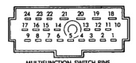

## DIAGNOSIS AND TESTING (Continued)

switch output circuit cavity of the washer pump wire harness connector. The meter should read battery voltage. If OK, replace the faulty pump. If not OK, repair the open circuit as required.

(5) Turn the ignition switch to the Off position. Disconnect and isolate the battery negative cable. Move the Central Timer Module (CTM) from its mounting position far enough so that the CTM wire harness connectors can be accessed. See Central Timer Module in the Removal and Installation section of Group 8E - Instrument Panel Systems for the procedures. Unplug the 14-way wire harness connector from the CTM. Connect the battery negative cable. Turn the ignition switch to the On position. With the washer switch depressed, check for battery voltage at the washer switch sense circuit cavity of the 14-way CTM wire harness connector. If OK, see Intermittent Wipe Relay in the Diagnosis and Testing section of this group. If not OK, repair the open circuit as required.

### WIPER SWITCH AND WASHER SWITCH

See Wiper System and/or Washer System in the Diagnosis and Testing section of this group before testing the multi-function switch. For circuit descriptions and diagrams, refer to 8W-53 - Wipers in Group 8W - Wiring Diagrams.

**WARNING: ON VEHICLES EQUIPPED WITH AN AIRBAG, REFER TO GROUP 8M - PASSIVE RESTRAINT SYSTEMS BEFORE ATTEMPTING ANY STEERING WHEEL, STEERING COLUMN, OR INSTRUMENT PANEL COMPONENT DIAGNOSIS OR SERVICE. FAILURE TO TAKE THE PROPER PRECAUTIONS COULD RESULT IN ACCIDENTAL AIRBAG DEPLOYMENT AND POSSIBLE PERSONAL INJURY.**

(1) Disconnect and isolate the battery negative cable.

(2) Unplug the multi-function switch wire harness connector from the multi-function switch.

(3) Using an ohmmeter, perform the switch continuity checks at the switch terminals as shown in the Multi-Function Switch Continuity chart (Fig. 2).

(4) If the switch fails any of the continuity checks, replace the faulty switch. If the switch is OK, repair the wiper system and/or washer system wire harness circuits as required.

### INTERMITTENT WIPE RELAY

For circuit descriptions and diagrams, refer to 8W-53 - Wipers in Group 8W - Wiring Diagrams.

**WARNING: ON VEHICLES EQUIPPED WITH AIRBAGS, REFER TO GROUP 8M - PASSIVE RESTRAINT SYSTEMS BEFORE ATTEMPTING ANY STEERING WHEEL, STEERING COLUMN, OR INSTRUMENT PANEL COMPONENT DIAGNOSIS OR SERVICE. FAILURE TO TAKE THE PROPER PRECAUTIONS COULD RESULT IN ACCIDENTAL AIRBAG DEPLOYMENT AND POSSIBLE PERSONAL INJURY.**

*Fig. 2*

**MULTI-FUNCTION SWITCH CONTINUITY**

| SWITCH POSITION | CONTINUITY BETWEEN |
|-----------------|-------------------|
| OFF | PIN 6 AND PIN 7 |
|  | PIN 8 AND PIN 9 |
|  | PIN 2 AND PIN 4 |
| DELAY | PIN 1 AND PIN 2 |
|  | PIN 1 AND PIN 4 |
| LOW | PIN 4 AND PIN 6 |
| HIGH | PIN 4 AND PIN 5 |
| WASH | PIN 3 AND PIN 4 |

RESISTANCE AT MAXIMUM DELAY POSITION SHOULD BE BETWEEN 270,000 OHMS AND 330,000 OHMS. RESISTANCE AT MINIMUM DELAY POSITION SHOULD BE ZERO WITH OHMMETER SET ON HIGH OHM SCALE.

*Fig. 2 Multi-Function Switch Continuity*

The intermittent wipe relay (Fig. 3) is located in the Power Distribution Center (PDC) in the engine compartment. Refer to the PDC label for intermittent wipe relay identification and location.

Remove the intermittent wipe relay from the PDC as described in the Removal and Installation section of this group to perform the following tests:

(1) A relay in the de-energized position should have continuity between terminals 87A and 30, and no continuity between terminals 87 and 30. If OK, go to Step 2. If not OK, replace the faulty relay.

(2) Resistance between terminals 85 and 86 (electromagnet) should be 75 +/- 5 ohms. If OK, go to Step 3. If not OK, replace the faulty relay.

(3) Connect a battery to terminals 85 and 86. There should now be continuity between terminals 30 and 87, and no continuity between terminals 87A and 30. If OK, see Relay Circuit Test in the Diagnosis and Testing section of this group. If not OK, replace the faulty relay.

#### RELAY CIRCUIT TEST

(1) The relay common feed terminal cavity (30) is connected to the wiper (multi-function) switch. There should be continuity between the cavity for relay terminal 30 and the two fused ignition switch output

---
*8K Wiper and Washer Systems - Page 6*
