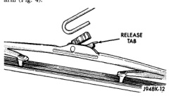

## DIAGNOSIS AND TESTING (Continued)

*Fig. 3 Intermittent Wipe Relay*

circuit cavities of the multi-function switch wire harness connector at all times. If OK, go to Step 2. If not OK, repair the open circuit(s) to the multi-function switch as required.

(2) The relay normally closed terminal (87A) is connected to terminal 30 in the de-energized position. There should be continuity between the cavity for relay terminal 87A and the wiper park switch sense circuit cavities of the wiper motor wire harness connector and the 14-way Central Timer Module (CTM) wire harness connector at all times. If OK, go to Step 3. If not OK, repair the open circuit(s) to the wiper motor and CTM as required.

(3) The relay normally open terminal (87) is connected to the common feed terminal (30) in the energized position. There should be battery voltage at the cavity for relay terminal 87 with the ignition switch in the On or Accessory positions. If OK, go to Step 4. If not OK, repair the open circuit to the ignition switch as required.

(4) The coil battery terminal (86) is connected to the electromagnet in the relay. There should be battery voltage at the cavity for relay terminal 86 with the ignition switch in the On or Accessory positions. If OK, go to Step 5. If not OK, repair the open circuit to the ignition switch as required.

(5) The coil ground terminal (85) is connected to the electromagnet in the relay. It is grounded by the CTM to energize the relay and cycle the wiper motor. Check for continuity between the cavity for relay terminal 85 and the intermittent wiper relay control circuit cavity of the 14-way CTM wire harness connector. There should be continuity. If OK, replace the faulty base version CTM; or, use a DRB scan tool and the proper Diagnostic Procedures manual for diagnosis of the high-line version CTM. If not OK, repair the open circuit to the CTM as required.

## REMOVAL AND INSTALLATION

### WIPER BLADE

**NOTE:** The notched retainer end of the wiper element should always be oriented towards the end of the wiper blade that is nearest to the wiper pivot.

(1) Turn the windshield wiper switch to the On position. By turning the ignition switch to the On and Off positions, cycle the wiper blades to a convenient working location on the windshield.

(2) Lift the wiper arm to raise the wiper blade and element off of the windshield glass.

(3) To remove the wiper blade from the wiper arm, push the release tab under the arm tip and slide the blade away from the tip towards the pivot end of the arm (Fig. 4).

[Figure]

*Fig. 4 Wiper Blade Remove/Install - Typical*

(4) To install the wiper blade on the wiper arm, slide the blade retainer into the U-shaped formation on the tip of the wiper arm until the release tab snaps into its locked position. Be certain that the notched retainer for the wiper element is oriented towards the end of the wiper blade that is nearest to the wiper pivot.

### WIPER ARM

**CAUTION:** The use of a screwdriver or other prying tool to remove a wiper arm may distort it. This distortion could allow the arm to come off of the pivot shaft, regardless of how carefully it is installed.

(1) Open the hood of the vehicle.

(2) Lift the wiper arm to permit the latch to be pulled out to its holding position, then release the arm (Fig. 5). The arm will remain off the windshield with the latch in this position.

(3) Remove the wiper arm from the pivot using a rocking motion.

(4) Install the wiper arm and blade with the wiper motor in the Park position. See the Wiper Arm Installation illustration (Fig. 6).

---
*8K Wiper and Washer Systems - Page 7*
