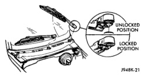
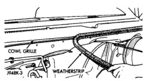
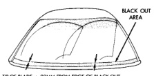
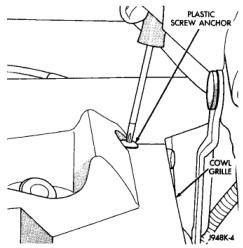

## REMOVAL AND INSTALLATION (Continued)

*Fig. 5 Wiper Arm Remove/Install*

*Fig. 6 Wiper Arm Installation*

*TIP OF BLADE +/- 22MM FROM EDGE OF BLACK OUT*

*Fig. 6 Wiper Arm Installation*

(5) Mount the arms on the pivot shafts so that the tip of the wiper blade is on the upper edge of the lower windshield blackout area +/- 22 mm (+/- 0.86 in.).

(6) Lift the wiper arm away from the windshield slightly to relieve the spring tension on the latch. Push the latch into the locked position and slowly release the arm until the wiper blade rests on the windshield.

(7) Operate the wipers with the windshield glass wet, then turn the wiper switch to the Off position. Check for the correct wiper arm positioning and readjust if required.

### WIPER LINKAGE AND PIVOT

The wiper linkage and pivots can only be removed from or installed in the vehicle as a unit with the wiper motor. See Wiper Motor in the Removal and Installation section of this group for the procedures.

### WIPER MOTOR

(1) Disconnect and isolate the battery negative cable.

(2) Remove the wiper arms from the wiper pivots. See Wiper Arm in the Removal and Installation section of this group for the procedures.

(3) Remove the weatherstrip along the front edge of the cowl plenum cover/grille panel and the cowl plenum panel (Fig. 7).

*Fig. 7 Cowl Plenum Cover/Grille Panel Weatherstrip*

(4) Remove the plastic screws that secure the cowl plenum cover/grille panel to the studs on the cowl top panel near the base of the windshield (Fig. 8).

*Fig. 8 Cowl Plenum Plastic Screws Remove/Install*

(5) Lift the cowl plenum cover/grille panel from the cowl top far enough to access the windshield washer nozzle plumbing near the left end of the cowl plenum.

(6) Disconnect the windshield washer supply hose at the wye fitting (Fig. 9).

---
*8K Wiper and Washer Systems - Page 8*
