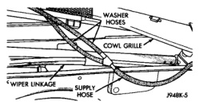
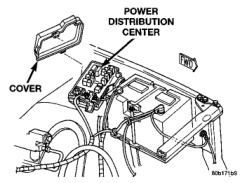
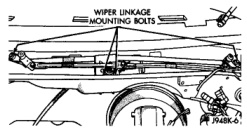
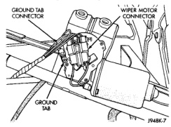

## REMOVAL AND INSTALLATION (Continued)

*Fig. 9 Washer Supply Hose Remove/Install*

(7) Remove the cowl plenum cover/grille panel from the vehicle and set it aside.

(8) Remove the four screws that secure the wiper module to the cowl plenum panel (Fig. 10).

*Fig. 10 Wiper Module Remove/Install*

(9) Move the wiper module as required to access the wiper motor wire harness connector.

(10) Unplug the wiper motor wire harness connectors from the wiper motor (Fig. 11).

*Fig. 11 Wiper Motor Wire Harness Connectors*

(11) Remove the wiper module from the cowl plenum.

(12) Reverse the removal procedures to install. Be certain that the washer nozzle hoses are correctly routed and installed in the retainers on the underside of the cowl plenum cover/grille panel. Tighten the mounting screws to 8 N-m (72 in. lbs.).

### INTERMITTENT WIPE RELAY

(1) Disconnect and isolate the battery negative cable.

(2) Remove the cover from the Power Distribution Center (PDC) (Fig. 12).

*Fig. 12 Power Distribution Center*

(3) Refer to the label on the PDC cover for intermittent wipe relay identification and location.

(4) Unplug the intermittent wipe relay from the PDC.

(5) Install the intermittent wipe relay by aligning the relay terminals with the cavities in the PDC and pushing the relay firmly into place.

(6) Install the PDC cover.

(7) Connect the battery negative cable.

(8) Test the relay operation.

### MULTI-FUNCTION SWITCH

**WARNING: ON VEHICLES EQUIPPED WITH AIRBAGS, REFER TO GROUP 8M - PASSIVE RESTRAINT SYSTEMS BEFORE ATTEMPTING ANY STEERING WHEEL, STEERING COLUMN, OR INSTRUMENT PANEL COMPONENT DIAGNOSIS OR SERVICE. FAILURE TO TAKE THE PROPER PRECAUTIONS COULD RESULT IN ACCIDENTAL AIRBAG DEPLOYMENT AND POSSIBLE PERSONAL INJURY.**

(1) Disconnect and isolate the battery negative cable.

(2) If the vehicle is so equipped, remove the tilt steering column lever.

(3) Remove both the upper and lower shrouds from the steering column (Fig. 13).

(4) Remove the lower fixed column shroud.

---
*8K Wiper and Washer Systems - Page 9*
