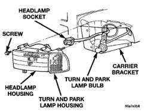

# LAMP SERVICE

## INDEX

| Section | Page |
|---------|------|
| **REMOVAL AND INSTALLATION** | |
| CARGO LAMP | 12 |
| CENTER HIGH MOUNTED STOP LAMP (CHMSL) | 11 |
| DOME LAMP | 13 |
| FOG LAMP | 10 |
| HEADLAMP | 10 |
| LICENSE PLATE LAMP | 13 |
| OVERHEAD CONSOLE READING LAMP | 14 |
| PARK, TURN SIGNAL AND SIDE MARKER LAMP | 11 |
| REAR IDENTIFICATION (ID) LAMPS | 12 |
| ROOF CLEARANCE LAMP | 11 |
| SIDE IDENTIFICATION (ID) LAMPS | 12 |
| TAIL, STOP, TURN SIGNAL AND BACK-UP LAMPS—CHASSIS CAB | 12 |
| TAIL, STOP, TURN SIGNAL AND BACK-UP LAMPS—PICKUP | 12 |

## REMOVAL AND INSTALLATION

### HEADLAMP

#### REMOVAL

(1) Release hood latch and open hood.

(2) Remove park and turn signal lamp.

(3) Remove screws holding top of headlamp module to radiator closure panel (Fig. 1).

(4) From behind front bumper, remove screws holding bottom of headlamp module to radiator closure panel.

(5) Separate headlamp module from radiator closure panel.

(6) Disengage wire connector from headlamp bulb.

(7) Separate headlamp module from vehicle.

#### INSTALLATION

(1) If removed, install headlamp bulb.

(2) Connect headlamp bulb wire connector.

(3) Position headlamp in radiator closure panel.

(4) From behind front bumper, install the screws holding bottom of headlamp module to radiator closure panel.

(5) Install the screws holding top of headlamp module to radiator closure panel (Fig. 1).

(6) Install park and turn signal lamp.

(7) Close hood.

*Fig. 1 Headlamp Removal/Installation*

### FOG LAMP

The fog lamps are serviced from the rearward side of the front bumper.

#### REMOVAL

(1) Disengage fog lamp harness connector.

(2) Remove fog lamp to bumper attaching nuts (Fig. 2).

(3) Separate fog lamp from bumper.

#### INSTALLATION

(1) Position fog lamp in bumper.

(2) Install fog lamp to bumper attaching nuts.

(3) Connect fog lamp harness connector.

(4) Check for proper operation and beam alignment.

---
*8L Lamps - Page 10*
