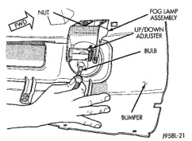
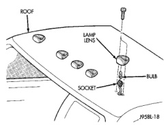
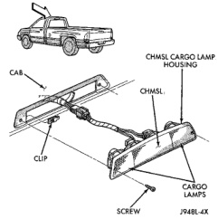

# REMOVAL AND INSTALLATION (Continued)

*Fig. 2 Fog Lamp*

### PARK, TURN SIGNAL AND SIDE MARKER LAMP

#### REMOVAL

(1) Remove screw attaching the park lamp to headlamp module.

(2) Grasp lamp and pull forward to disengage clip attaching park/turn lamp to headlamp module.

(3) Separate park lamp headlamp module.

(4) Rotate park/turn signal socket 1/4 turn counter-clockwise and remove from back of lamp.

(5) Remove side marker socket from back of lamp.

(6) Separate park/turn signal lamp from vehicle.

#### INSTALLATION

(1) Install side marker socket from back of lamp.

(2) Install park/turn signal socket in back of lamp.

(3) Install park/turn signal lamp in vehicle.

(4) Install screw attaching the park lamp to headlamp module.

### ROOF CLEARANCE LAMP

#### REMOVAL

(1) Remove screws holding clearance lamp lens to roof panel (Fig. 3).

(2) Rotate socket 1/4 turn counterclockwise and separate socket from lamp.

#### INSTALLATION

(1) Install socket in lamp and rotate socket 1/4 turn clockwise.

(2) Position clearance lamp on roof.

(3) Install screws holding clearance lamp lens to roof panel. Tighten to 1 N-m (13 in. lbs.).

*Fig. 3 Roof Clearance Lamps*

### CENTER HIGH MOUNTED STOP LAMP (CHMSL)

#### REMOVAL

(1) Remove screws holding CHMSL to roof panel (Fig. 4).

(2) Separate CHMSL from roof.

(3) Disengage wire connector from body wire harness.

(4) Separate CHMSL from vehicle.

*Fig. 4 Center High Mounted Stop Lamp*

#### INSTALLATION

(1) Position lamp at cab roof and connect wire connector.

(2) Install screws holding CHMSL to roof panel. Tighten securely.

---
*8L Lamps - Page 11*
