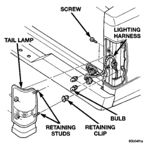
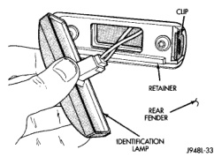

# REMOVAL AND INSTALLATION (Continued)

### CARGO LAMP

The cargo lamp is incorporated into the CHMSL, if equipped. Refer to Center High Mounted Stop Lamp paragraph for service procedures.

### SIDE IDENTIFICATION (ID) LAMPS

#### REMOVAL

(1) Using a flat blade screw driver, carefully pry lamp to disengage clips attaching ID lamp to retainer (Fig. 5).

(2) Separate ID lamp from retainer.

(3) Disengage lamp bulb socket from lamp.

(4) Remove screws attaching lamp retainer to rear fender.

(5) Separate retainer from rear fender.

*Fig. 5 Side Identification Lamps*

#### INSTALLATION

(1) Position retainer on rear fender.

(2) Install screws attaching lamp retainer to rear fender.

(3) Engage lamp bulb socket to lamp.

(4) Position and press ID lamp in retainer.

### TAIL, STOP, TURN SIGNAL AND BACK-UP LAMPS—PICKUP

#### REMOVAL

(1) Release tailgate latch and open tailgate.

(2) Remove screws holding tail lamp to cargo box (Fig. 6).

(3) Grasp lamp, firmly pull lamp rearward to disengage retaining studs.

(4) Remove socket from tail lamp.

(5) Separate tail lamp from cargo box.

(6) Separate tail lamp from vehicle.

*Fig. 6 Tail Lamp Assembly*

#### INSTALLATION

(1) Install socket in tail lamp.

(2) Position tail lamp in cargo box, engage retaining studs and install screws.

(3) Close tailgate.

### TAIL, STOP, TURN SIGNAL AND BACK-UP LAMPS—CHASSIS CAB

#### REMOVAL

(1) Remove nuts holding tail lamp to mounting bracket (Fig. 7).

(2) Disengage tail lamp wire connector from body wire harness.

(3) Separate tail lamp from vehicle.

#### INSTALLATION

Reverse the removal procedure.

### REAR IDENTIFICATION (ID) LAMPS

Individual lamps may be replaced by removing the lamp from the light bar.

#### REMOVAL

(1) Remove screws holding rear ID lamps to tailgate (Fig. 8).

(2) Separate ID lamps from tailgate.

(3) Disengage ID lamp wire connector from body wire harness.

(4) Separate ID lamp from vehicle.

#### INSTALLATION

Reverse the removal procedure.

---
*8L Lamps - Page 12*
