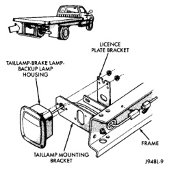
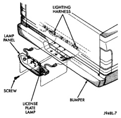
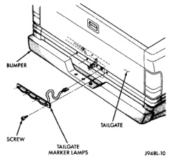

# REMOVAL AND INSTALLATION (Continued)

*Fig. 7 Tail, Stop, Turn Signal and Back-up Lamps—Cab Chassis*

*Fig. 8 Rear Identification Lamps*

### LICENSE PLATE LAMP

#### REMOVAL

(1) Remove screws holding license plate panel to cargo box.

(2) Disengage license plate lamp wire connector from body wire harness (Fig. 9).

(3) Separate license plate lamp from vehicle.

*Fig. 9 License Plate Lamp Panel*

#### INSTALLATION

Reverse the removal procedure.

### DOME LAMP

#### REMOVAL

(1) Using a suitable flat blade screw driver, pry dome lamp lens from dome lamp.

(2) Remove screws holding dome lamp to roof reinforcement (Fig. 10).

(3) Separate dome lamp from roof.

(4) Disengage dome lamp wire connector from body wire harness.

(5) Separate dome lamp from vehicle.

---
*8L Lamps - Page 13*
