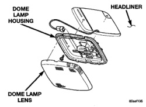

# REMOVAL AND INSTALLATION (Continued)

#### INSTALLATION

(1) Position dome lamp at headliner.

(2) Connect dome lamp wire connector to body wire harness.

(3) Install screws holding dome lamp to roof reinforcement (Fig. 10).

(4) Place dome lamp lens on dome lamp and snap into place.

### OVERHEAD CONSOLE READING LAMP

To service overhead console refer to Group 8C, Overhead Console.

*Fig. 10 Dome Lamp*

---
*8L Lamps - Page 14*
