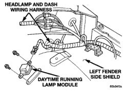

# LAMP SYSTEMS

## INDEX

| Section | Page |
|---------|------|
| **REMOVAL AND INSTALLATION** | |
| DAYTIME RUNNING LAMP MODULE (DRLM) | 15 |

## REMOVAL AND INSTALLATION

### DAYTIME RUNNING LAMP MODULE (DRLM)

#### REMOVAL

(1) Release hood latch and open hood.

(2) Disengage wire connector from DRLM (Fig. 1).

(3) Remove screws attaching DRLM to left front inner fender panel.

(4) Separate DRLM from fender.

#### INSTALLATION

(1) Position DRLM on fender.

(2) Install screws attaching DRLM to left front inner fender panel.

(3) Engage wire connector to DRLM (Fig. 1).

(4) Close hood.

*Fig. 1 Daytime Running Lamp Module (DRLM)*

---
*8L Lamps - Page 15*
