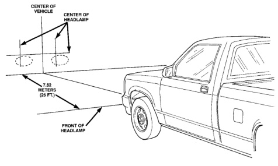
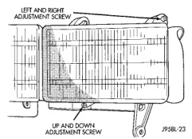

# SERVICE PROCEDURES (Continued)

*Fig. 1 Headlamp Alignment Screen—Typical*

## HEADLAMP ADJUSTMENT

A properly aimed low beam headlamp will project top edge of high intensity pattern on screen from 50 mm (2 in.) above to 50 mm (2 in.) below headlamp centerline. The side-to-side outboard edge of high intensity pattern should be from 50 mm (2 in.) left to 50 mm (2 in.) right of headlamp centerline (Fig. 1). **The preferred headlamp alignment is 1" down for the up/down adjustment and 0 for the left/right adjustment.** The high beam pattern should be correct when the low beams are aligned properly.

To adjust headlamp aim, rotate alignment screws (Fig. 2) to achieve the specified high intensity pattern.

*Fig. 2 Aero Headlamp Alignment*

---
*8L Lamps - Page 5*
