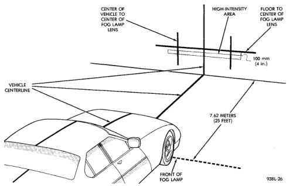
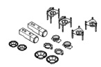

# SERVICE PROCEDURES (Continued)

*Fig. 3 Fog Lamp Alignment—Typical*

## FOG LAMP ALIGNMENT

Prepare an alignment screen. Refer to Alignment Screen Preparation paragraph in this section. A properly aligned fog lamp will project a pattern on the alignment screen 100 mm (4 in.) below the fog lamp centerline and straight ahead (Fig. 3).

## SPECIAL TOOLS

### SPECIAL TOOLS—HEADLAMP ALIGNMENT

*Fig. 4*

*Headlamp Aiming Kit C-4466-A*

---
*8L Lamps - Page 6*
