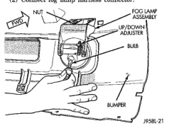

# LAMP BULB SERVICE

## INDEX

| Section | Page |
|---------|------|
| **REMOVAL AND INSTALLATION** | |
| CARGO LAMP BULB | 8 |
| CENTER HIGH MOUNTED STOP LAMP (CHMSL) BULB | 9 |
| DOME LAMP BULB | 9 |
| FOG LAMP | 7 |
| HEADLAMP | 7 |
| LICENSE PLATE LAMP BULB | 9 |
| OVERHEAD CONSOLE READING LAMP BULB | 9 |
| PARK AND TURN SIGNAL LAMP | 8 |
| REAR IDENTIFICATION (ID) LAMP BULBS | 9 |
| ROOF CLEARANCE LAMP BULB | 8 |
| SIDE IDENTIFICATION (ID) LAMP BULBS | 8 |
| TAIL, STOP, TURN SIGNAL AND BACK-UP LAMP BULB—CAB CHASSIS | 9 |
| TAIL, STOP, TURN SIGNAL AND BACK-UP LAMP BULB—PICKUP | 8 |
| UNDERHOOD LAMP BULB | 9 |

## REMOVAL AND INSTALLATION

### HEADLAMP

On driver side and on vehicles with dual batteries, the headlamp assembly must be removed to service the headlamp bulb.

#### REMOVAL

(1) Release hood latch and open hood.

(2) To remove headlamp assembly on drivers side or passenger side when equipped with dual batteries, refer to Headlamp Removal paragraph of Exterior Lamps section.

(3) Disengage wire connector from headlamp bulb.

(4) Remove retaining ring holding bulb to headlamp (Fig. 1).

(5) Pull bulb from headlamp.

*Fig. 1 Headlamp Bulb Removal*

#### INSTALLATION

**CAUTION: Do not touch the bulb glass with fingers or other oily surfaces. Reduced bulb life will result.**

(1) Position bulb in headlamp.

(2) Install retaining ring holding bulb to headlamp (Fig. 1).

(3) Connect wire connector to headlamp bulb.

### FOG LAMP

#### REMOVAL

(1) Disengage fog lamp harness connector.

(2) Rotate bulb assembly counterclockwise and pull from lamp to separate (Fig. 2).

#### INSTALLATION

**CAUTION: Do not touch the bulb glass with fingers or other oily surfaces. Reduced bulb life will result.**

(1) Position bulb assembly in lamp and rotate clockwise.

(2) Connect fog lamp harness connector.

[Figure]

*Fig. 2 Fog Lamp*

---
*8L Lamps - Page 7*
